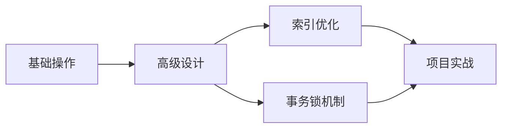

# MySQL 完整学习指南

> 从入门到精通,系统掌握MySQL数据库技术

---

## 📚 学习路线

本教程按照由浅入深的顺序组织,建议按以下顺序学习:

### 第一阶段: 基础入门

#### [01. MySQL基础操作](./01.MySQL基础操作/mysql基础.md)
**适合人群:** 完全零基础的学习者

**学习内容:**
- ✅ 数据库基本概念
- ✅ MySQL安装与配置
- ✅ SQL语言基础语法
- ✅ DDL: 数据库和表的操作
- ✅ DML: 数据的增删改
- ✅ DQL: 基础查询操作
- ✅ Navicat工具使用

**学习目标:** 
能够独立完成MySQL的安装配置,编写基本的SQL语句进行数据操作。

---

#### [02. MySQL设计和多表操作](./02.MySQL设计和多表操作/mysql高级.md)
**前置知识:** 完成第一阶段学习

**学习内容:**
- ✅ 约束(主键、外键、唯一、非空等)
- ✅ 数据库设计原则
- ✅ 表关系(一对一、一对多、多对多)
- ✅ 多表查询(内连接、外连接)
- ✅ 子查询
- ✅ 事务基础

**学习目标:**
掌握数据库设计规范,能够设计合理的表结构,熟练编写多表查询SQL。

---

### 第二阶段: 进阶提升

#### [03. MySQL索引与性能优化](./03.MySQL索引与性能优化/mysql索引与优化.md)
**前置知识:** 完成前两阶段学习

**学习内容:**
- ✅ 索引底层原理(B+树)
- ✅ 索引类型与创建
- ✅ 最左前缀原则
- ✅ 索引失效场景
- ✅ EXPLAIN性能分析
- ✅ SQL优化技巧
- ✅ 索引最佳实践

**学习目标:**
深入理解索引原理,能够分析和优化慢查询,设计高效的索引策略。

---

#### [04. MySQL事务与锁机制](./04.MySQL事务与锁机制/mysql事务与锁.md)
**前置知识:** 理解基础的SQL操作

**学习内容:**
- ✅ ACID特性详解
- ✅ 事务隔离级别
- ✅ 并发问题(脏读、不可重复读、幻读)
- ✅ 锁机制(行锁、表锁、间隙锁)
- ✅ MVCC多版本并发控制
- ✅ 死锁分析与解决
- ✅ 实战案例分析

**学习目标:**
掌握事务和锁的核心原理,能够处理高并发场景下的数据一致性问题。

---

### 第三阶段: 实战应用

#### [08. MySQL项目实战案例](./08.MySQL项目实战案例/mysql项目实战.md)
**前置知识:** 建议完成前面所有阶段的学习

**学习内容:**
- ✅ 电商系统数据库设计
- ✅ 博客系统数据库设计
- ✅ 学生管理系统实战
- ✅ 典型业务SQL实现
- ✅ 性能优化实战
- ✅ 常见问题解决方案

**学习目标:**
能够将所学知识应用到实际项目中,独立完成数据库设计和优化。

---

## 🎯 学习建议

### 1. 理论学习 + 实践操作

每个章节都包含:
- 📖 理论讲解: 理解概念和原理
- 💻 代码示例: 跟着动手实践
- 🎮 练习题: 巩固所学知识

**建议:**
- 不要只看不练,一定要亲手执行SQL语句
- 遇到错误不要怕,这是最好的学习机会
- 多做练习,熟能生巧

### 2. 循序渐进



**不建议跳跃学习**,因为后面的内容会依赖前面的知识。

### 3. 建立知识体系

学习过程中,建议:
- 📝 做笔记,记录重点和疑问
- 🔗 建立知识点之间的联系
- 🔄 定期复习,加深记忆
- 💡 思考实际应用场景

### 4. 善用工具

推荐工具:
- **Navicat**: 图形化管理工具,方便直观
- **MySQL Workbench**: 官方工具,功能强大
- **DBeaver**: 开源免费,支持多种数据库
- **EXPLAIN**: 分析SQL性能的神器
- **慢查询日志**: 发现性能问题

---

## 📋 核心知识点速查

### SQL分类

| 类型 | 全称 | 作用 | 常用命令 |
|------|------|------|----------|
| DDL | Data Definition Language | 定义数据库对象 | CREATE, ALTER, DROP |
| DML | Data Manipulation Language | 操作数据 | INSERT, UPDATE, DELETE |
| DQL | Data Query Language | 查询数据 | SELECT |
| DCL | Data Control Language | 权限控制 | GRANT, REVOKE |
| TCL | Transaction Control Language | 事务控制 | COMMIT, ROLLBACK |

### 常用数据类型

**数值类型:**
- `INT`: 整数,4字节
- `BIGINT`: 大整数,8字节
- `DECIMAL(M,D)`: 精确小数
- `DOUBLE`: 浮点数

**字符串类型:**
- `CHAR(N)`: 定长字符串
- `VARCHAR(N)`: 变长字符串
- `TEXT`: 长文本

**日期时间:**
- `DATE`: 日期
- `TIME`: 时间
- `DATETIME`: 日期时间
- `TIMESTAMP`: 时间戳

### 索引类型

- **主键索引**: PRIMARY KEY,唯一且非空
- **唯一索引**: UNIQUE,值唯一
- **普通索引**: INDEX,加速查询
- **联合索引**: 多个字段的索引
- **全文索引**: FULLTEXT,全文搜索

### 事务隔离级别

| 级别 | 脏读 | 不可重复读 | 幻读 |
|------|------|-----------|------|
| READ UNCOMMITTED | ❌ | ❌ | ❌ |
| READ COMMITTED | ✅ | ❌ | ❌ |
| REPEATABLE READ | ✅ | ✅ | ✅* |
| SERIALIZABLE | ✅ | ✅ | ✅ |

> *InnoDB通过MVCC基本解决幻读

### 锁的类型

- **共享锁(S)**: 读锁,多个事务可同时持有
- **排他锁(X)**: 写锁,只允许一个事务持有
- **意向锁**: 表级锁,提高加锁效率
- **间隙锁**: 锁定索引之间的间隙
- **临键锁**: 记录锁 + 间隙锁

---

## 🔧 常用命令速查

### 数据库操作

```sql
-- 创建数据库
CREATE DATABASE IF NOT EXISTS mydb CHARACTER SET utf8mb4;

-- 使用数据库
USE mydb;

-- 查看所有数据库
SHOW DATABASES;

-- 删除数据库
DROP DATABASE IF EXISTS mydb;
```

### 表操作

```sql
-- 创建表
CREATE TABLE user (
    id INT PRIMARY KEY AUTO_INCREMENT,
    name VARCHAR(50) NOT NULL,
    age INT,
    email VARCHAR(100) UNIQUE,
    created_at DATETIME DEFAULT CURRENT_TIMESTAMP
);

-- 查看表结构
DESC user;

-- 查看所有表
SHOW TABLES;

-- 删除表
DROP TABLE IF EXISTS user;
```

### 数据操作

```sql
-- 插入数据
INSERT INTO user (name, age, email) VALUES ('张三', 25, 'zhangsan@example.com');

-- 更新数据
UPDATE user SET age = 26 WHERE id = 1;

-- 删除数据
DELETE FROM user WHERE id = 1;

-- 查询数据
SELECT * FROM user WHERE age > 20 ORDER BY age DESC LIMIT 10;
```

### 索引操作

```sql
-- 创建索引
CREATE INDEX idx_name ON user(name);
CREATE UNIQUE INDEX idx_email ON user(email);
CREATE INDEX idx_name_age ON user(name, age);

-- 查看索引
SHOW INDEX FROM user;

-- 删除索引
DROP INDEX idx_name ON user;
```

### 事务操作

```sql
-- 开启事务
START TRANSACTION;

-- 提交事务
COMMIT;

-- 回滚事务
ROLLBACK;

-- 设置隔离级别
SET SESSION TRANSACTION ISOLATION LEVEL READ COMMITTED;
```

### 性能分析

```sql
-- 分析SQL执行计划
EXPLAIN SELECT * FROM user WHERE name = '张三';

-- 查看慢查询配置
SHOW VARIABLES LIKE 'slow_query_log';
SHOW VARIABLES LIKE 'long_query_time';

-- 查看正在执行的进程
SHOW FULL PROCESSLIST;

-- 查看InnoDB状态
SHOW ENGINE INNODB STATUS\G
```

---

## 🎓 学习资源推荐

### 官方文档
- [MySQL 8.0 Reference Manual](https://dev.mysql.com/doc/refman/8.0/en/)
- [MySQL开发者专区](https://dev.mysql.com/)

### 在线练习
- [SQLZoo](https://sqlzoo.net/): 交互式SQL练习
- [LeetCode Database](https://leetcode.com/problemset/database/): 数据库面试题
- [HackerRank SQL](https://www.hackerrank.com/domains/sql): SQL挑战

### 相关书籍
- 《高性能MySQL》: 深入学习MySQL必备
- 《MySQL技术内幕: InnoDB存储引擎》: 理解InnoDB internals
- 《SQL必知必会》: SQL入门经典

### 工具推荐
- **Navicat**: 强大的数据库管理工具
- **MySQL Workbench**: 官方可视化工具
- **DBeaver**: 开源免费的通用数据库工具
- **DataGrip**: JetBrains出品的数据库IDE

---

## 💡 常见问题

### Q1: 学习MySQL需要编程基础吗?

A: 不需要。SQL是一门独立的语言,即使没有编程经验也可以学习。当然,有编程基础会更容易理解一些概念。

### Q2: MySQL和SQL有什么区别?

A: SQL是结构化查询语言,是一种标准;MySQL是一个具体的数据库管理系统(DBMS),它使用SQL作为操作语言。其他DBMS如PostgreSQL、Oracle也使用SQL。

### Q3: 学完这些内容能找到工作吗?

A: 这些内容涵盖了MySQL的核心知识,对于初级开发岗位是足够的。但实际工作中还需要:
- 结合具体的编程语言(Java、Python等)
- 了解ORM框架(MyBatis、Hibernate等)
- 积累实际项目经验
- 持续学习和实践

### Q4: 多久能学完?

A: 因人而异,一般建议:
- 基础阶段(01-02): 1-2周
- 进阶阶段(03-04): 2-3周
- 实战阶段(08): 1-2周
- 总计: 1-2个月(每天2-3小时)

关键是理解和实践,不要急于求成。

### Q5: 如何验证学习效果?

A: 
1. 完成每章的练习题
2. 能够独立设计数据库
3. 能够优化慢查询
4. 尝试做完整的项目
5. 刷LeetCode数据库题目

---

## 📝 更新日志

- **2024-01-15**: 创建基础文档结构
- **2024-01-20**: 完成索引与优化章节
- **2024-01-25**: 完成事务与锁机制章节
- **2024-02-01**: 完成项目实战案例章节

---

## 🤝 贡献指南

如果你发现文档中有错误或想补充内容,欢迎:
1. 提Issue反馈问题
2. 提Pull Request贡献内容
3. 分享给需要的朋友

---

## 📄 许可证

本教程仅供学习使用,转载请注明出处。

---

**祝你学习愉快! 🎉**

如有问题,欢迎交流学习心得和经验!
