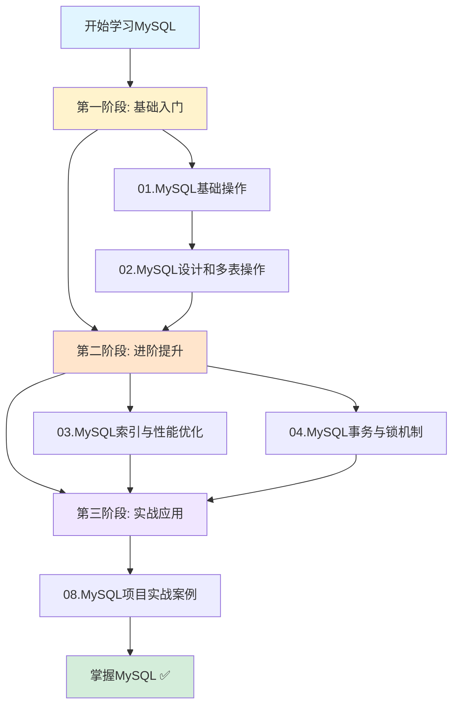

# MySQL 学习路线图

> 从零开始,系统掌握MySQL数据库技术

---

## 🗺️ 完整学习路径



---

## 📖 各阶段详细说明

### 第一阶段: 基础入门 (预计2-3周)

**目标:** 能够熟练使用SQL进行基本的数据库操作

#### Week 1: MySQL基础操作

| 天数 | 学习内容 | 重点 | 练习 |
|------|---------|------|------|
| Day 1-2 | 数据库概念、MySQL安装 | 理解DB、DBMS、SQL的关系 | 完成MySQL安装配置 |
| Day 3-4 | SQL语法基础、DDL | CREATE、ALTER、DROP | 创建数据库和表 |
| Day 5-7 | DML、DQL基础 | INSERT、UPDATE、DELETE、SELECT | 完成CRUD练习 |

**关键技能:**
- ✅ 能够独立安装配置MySQL
- ✅ 熟练使用Navicat等工具
- ✅ 编写基本的增删改查SQL

**检查点:**
- [ ] 成功安装MySQL并连接
- [ ] 创建一个包含5个字段以上的表
- [ ] 插入10条测试数据
- [ ] 能够查询、更新、删除数据

---

#### Week 2: MySQL高级设计

| 天数 | 学习内容 | 重点 | 练习 |
|------|---------|------|------|
| Day 1-2 | 约束(主键、外键、唯一等) | 保证数据完整性 | 为表添加各种约束 |
| Day 3-4 | 表关系设计 | 一对一、一对多、多对多 | 设计简单的ER图 |
| Day 5-7 | 多表查询、子查询 | JOIN、子查询 | 完成复杂查询练习 |

**关键技能:**
- ✅ 理解并能应用各种约束
- ✅ 能够设计合理的表结构
- ✅ 熟练编写多表JOIN查询

**检查点:**
- [ ] 设计一个包含3张关联表的数据库
- [ ] 正确设置外键关系
- [ ] 编写至少5个不同的JOIN查询
- [ ] 使用子查询解决实际问题

---

### 第二阶段: 进阶提升 (预计3-4周)

**目标:** 深入理解MySQL核心原理,能够进行性能优化

#### Week 3-4: MySQL索引与性能优化

| 天数 | 学习内容 | 重点 | 练习 |
|------|---------|------|------|
| Day 1-3 | 索引原理、B+树 | 理解索引数据结构 | 画图说明B+树 |
| Day 4-6 | 索引类型、创建策略 | 最左前缀原则 | 为实际表创建索引 |
| Day 7-10 | EXPLAIN分析、优化技巧 | 识别慢查询 | 优化10个慢查询 |
| Day 11-14 | 索引最佳实践 | 避免索引失效 | 设计索引方案 |

**关键技能:**
- ✅ 深入理解B+树原理
- ✅ 能够使用EXPLAIN分析SQL
- ✅ 设计高效的索引策略
- ✅ 识别并解决索引失效问题

**检查点:**
- [ ] 能够解释B+树的优势
- [ ] 熟练使用EXPLAIN分析查询
- [ ] 为一个电商系统设计索引
- [ ] 优化至少5个慢查询案例

---

#### Week 5-6: MySQL事务与锁机制

| 天数 | 学习内容 | 重点 | 练习 |
|------|---------|------|------|
| Day 1-3 | ACID特性、事务操作 | 理解原子性、一致性等 | 编写事务代码 |
| Day 4-6 | 隔离级别、并发问题 | 脏读、不可重复读、幻读 | 演示并发问题 |
| Day 7-10 | 锁机制(MVCC、行锁、间隙锁) | 理解锁的实现 | 模拟死锁场景 |
| Day 11-14 | 死锁处理、实战案例 | 预防和解决死锁 | 实现库存扣减 |

**关键技能:**
- ✅ 理解ACID的实现原理
- ✅ 掌握四种隔离级别的区别
- ✅ 理解MVCC工作机制
- ✅ 能够分析和解决死锁

**检查点:**
- [ ] 能够演示三种并发问题
- [ ] 解释RC和RR级别的区别
- [ ] 分析并解决一个死锁案例
- [ ] 实现一个线程安全的库存扣减

---

### 第三阶段: 实战应用 (预计2-3周)

**目标:** 将所学知识应用到实际项目中

#### Week 7-9: 项目实战

| 天数 | 学习内容 | 重点 | 练习 |
|------|---------|------|------|
| Day 1-5 | 电商系统设计 | 完整的数据库设计 | 实现核心功能SQL |
| Day 6-10 | 博客系统/学生管理系统 | 不同业务场景 | 独立完成设计 |
| Day 11-15 | 性能优化实战 | 综合应用所学知识 | 优化真实项目 |
| Day 16-21 | 扩展学习 | 分库分表、读写分离 | 研究高级主题 |

**关键技能:**
- ✅ 能够独立完成数据库设计
- ✅ 编写高效、可维护的SQL
- ✅ 进行全面的性能优化
- ✅ 解决实际问题

**检查点:**
- [ ] 完成一个完整项目的数据库设计
- [ ] 实现所有核心业务的SQL
- [ ] 进行性能测试和优化
- [ ] 撰写设计文档和优化报告

---

## 🎯 学习目标对照表

### 初级开发工程师

| 技能 | 要求 | 对应章节 |
|------|------|---------|
| SQL基础 | 熟练编写CRUD | 01.MySQL基础操作 |
| 表设计 | 能设计简单表结构 | 02.MySQL设计 |
| 多表查询 | 会使用JOIN | 02.MySQL设计 |
| 基础索引 | 知道如何创建索引 | 03.索引与优化 |

### 中级开发工程师

| 技能 | 要求 | 对应章节 |
|------|------|---------|
| 索引优化 | 能分析和优化慢查询 | 03.索引与优化 |
| 事务控制 | 理解ACID和隔离级别 | 04.事务与锁 |
| 锁机制 | 理解行锁、间隙锁 | 04.事务与锁 |
| 数据库设计 | 能设计复杂系统 | 08.项目实战 |

### 高级开发工程师

| 技能 | 要求 | 对应章节 |
|------|------|---------|
| 性能调优 | 全面优化数据库性能 | 03 + 08 |
| 并发控制 | 处理高并发场景 | 04.事务与锁 |
| 架构设计 | 分库分表、读写分离 | 扩展学习 |
| 故障排查 | 快速定位和解决问题 | 综合应用 |

---

## 📊 知识掌握自测

### 基础篇 (完成01-02后自测)

**选择题:**

1. 以下哪个不是SQL的分类?
   - A. DDL
   - B. DML  
   - C. DCL
   - D. DLL

2. 主键约束的特点是?
   - A. 可以为NULL
   - B. 可以重复
   - C. 非空且唯一
   - D. 一张表可以有多个

3. 以下哪种表关系需要中间表?
   - A. 一对一
   - B. 一对多
   - C. 多对多
   - D. 都不需要

**实操题:**

1. 创建一个学生表,包含id、姓名、年龄、性别、班级等字段
2. 插入10条学生数据
3. 查询年龄大于20岁的男学生
4. 创建一个班级表,并与学生表建立外键关系
5. 查询每个班级的学生人数

---

### 进阶篇 (完成03-04后自测)

**理论题:**

1. 解释B+树为什么适合作为索引结构?
2. 什么是最左前缀原则?举例说明
3. 列举5种索引失效的场景
4. 解释脏读、不可重复读、幻读的区别
5. MVCC是如何实现非阻塞读的?

**分析题:**

1. 给定一个慢查询,使用EXPLAIN分析并优化
2. 分析一个死锁日志,找出死锁原因
3. 设计一个高并发场景下的库存扣减方案

**实操题:**

1. 为一个100万数据的表设计索引方案
2. 优化一个深分页查询
3. 实现一个带重试机制的事务

---

### 实战篇 (完成08后自测)

**设计题:**

1. 设计一个在线教育的数据库,包括课程、章节、视频、学习记录等
2. 设计一个社交媒体的数据库,包括用户、动态、评论、点赞、关注等
3. 设计一个外卖系统的数据库,包括商家、菜品、订单、配送等

**优化题:**

1. 给定一个电商系统的慢查询日志,提出优化方案
2. 分析一个实际项目的数据库设计,指出问题和改进建议

**综合题:**

1. 从零开始设计并实现一个博客系统
2. 对系统进行压力测试,找出性能瓶颈并优化

---

## 🔗 相关资源

### 官方文档
- [MySQL 8.0官方文档](https://dev.mysql.com/doc/refman/8.0/en/)
- [MySQL开发者专区](https://dev.mysql.com/)

### 在线练习平台
- [LeetCode Database Problems](https://leetcode.com/problemset/database/)
- [HackerRank SQL](https://www.hackerrank.com/domains/sql)
- [SQLZoo](https://sqlzoo.net/)

### 推荐书籍
- 《高性能MySQL》- Baron Schwartz
- 《MySQL技术内幕: InnoDB存储引擎》- 姜承尧
- 《SQL必知必会》- Ben Forta

### 视频教程
- B站搜索"MySQL教程"
- 慕课网、极客时间相关课程

---

## 💪 学习建议

### DO ✅

1. **动手实践**: 每学一个知识点都要亲自敲代码
2. **做笔记**: 记录重点、难点和疑问
3. **多思考**: 不仅要知其然,还要知其所以然
4. **定期复习**: 每周回顾本周所学
5. **交流讨论**: 加入技术社区,与他人交流
6. **项目驱动**: 通过实际项目巩固知识

### DON'T ❌

1. **不要只看不练**: 理论学习必须配合实践
2. **不要死记硬背**: 理解原理比记忆更重要
3. **不要急于求成**: 打好基础再进阶
4. **不要忽视基础**: 高级技术都建立在基础之上
5. **不要闭门造车**: 多看看别人的优秀实践

---

## 📈 学习进度跟踪

建议使用以下方式跟踪学习进度:

### 方式1: Checklist

复制下面的模板,每完成一项打勾:

```markdown
## 我的学习进度

### 第一阶段: 基础入门
- [ ] 01.MySQL基础操作
  - [ ] 数据库概念
  - [ ] MySQL安装
  - [ ] SQL语法
  - [ ] DDL操作
  - [ ] DML操作
  - [ ] DQL基础
- [ ] 02.MySQL设计和多表操作
  - [ ] 约束
  - [ ] 表关系
  - [ ] 多表查询
  - [ ] 子查询

### 第二阶段: 进阶提升
- [ ] 03.MySQL索引与性能优化
  - [ ] 索引原理
  - [ ] 索引类型
  - [ ] EXPLAIN分析
  - [ ] 优化技巧
- [ ] 04.MySQL事务与锁机制
  - [ ] ACID特性
  - [ ] 隔离级别
  - [ ] 锁机制
  - [ ] MVCC
  - [ ] 死锁

### 第三阶段: 实战应用
- [ ] 08.MySQL项目实战案例
  - [ ] 电商系统
  - [ ] 博客系统
  - [ ] 学生管理系统
  - [ ] 性能优化
```

### 方式2: 学习笔记

为每个章节创建学习笔记,记录:
- 学了什么
- 有什么收获
- 遇到什么问题
- 如何解决
- 还有什么疑问

### 方式3: GitHub仓库

创建自己的GitHub仓库:
- 保存练习代码
- 记录学习笔记
- 展示项目作品
- 建立个人品牌

---

## 🎉 结语

学习MySQL是一个循序渐进的过程,需要:
- **耐心**: 不要急于求成
- **恒心**: 坚持每天学习
- **信心**: 相信自己能够掌握

记住:
> "不积跬步,无以至千里;不积小流,无以成江海。"

每一天的进步都很重要,坚持下去,你一定能成为MySQL高手!

**加油!💪**

---

*最后更新: 2024-02-01*
