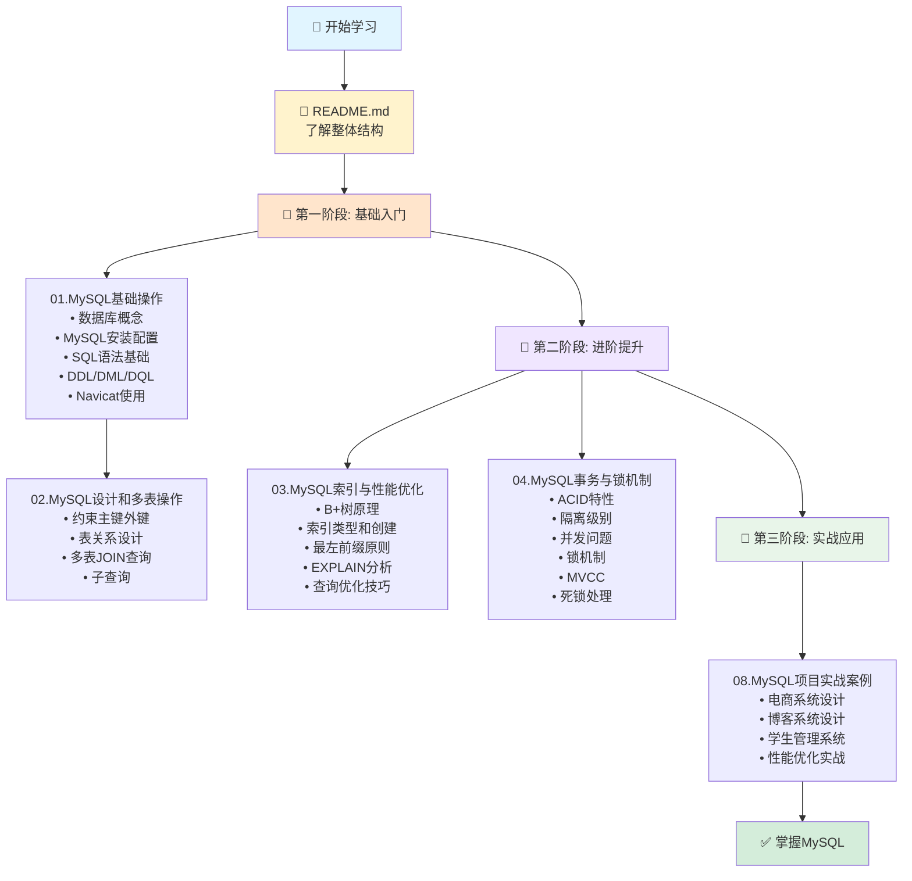

# MySQL 知识体系总览

> 📚 完整的MySQL学习资源导航

---

## 🗂️ 目录结构

```
MySQL/
│
├── 📖 学习指南
│   ├── README.md                    # 🎯 学习指南总览(从这里开始)
│   ├── 学习路线.md                  # 🗺️ 详细学习计划(9周计划)
│   ├── MySQL速查手册.md             # 🔧 快速参考手册
│   └── 补充说明.md                  # 📝 本次补充说明
│
├── 📘 第一阶段: 基础入门
│   ├── 01.MySQL基础操作/
│   │   └── mysql基础.md            # 数据库概念、安装、SQL基础、CRUD
│   │
│   └── 02.MySQL设计和多表操作/
│       └── mysql高级.md            # 约束、表关系、多表查询、子查询
│
├── 📗 第二阶段: 进阶提升
│   ├── 03.MySQL索引与性能优化/
│   │   └── mysql索引与优化.md      # B+树、索引类型、EXPLAIN、优化技巧
│   │
│   └── 04.MySQL事务与锁机制/
│       └── mysql事务与锁.md        # ACID、隔离级别、锁机制、MVCC、死锁
│
└── 📙 第三阶段: 实战应用
    └── 08.MySQL项目实战案例/
        └── mysql项目实战.md        # 电商系统、博客系统、学生管理系统
```

---

## 📊 知识地图



---

## 📚 各文档详细说明

### 📖 学习指南系列

#### [README.md](./README.md) - 学习指南总览
**适合人群:** 所有学习者  
**阅读时间:** 15分钟  

**内容:**
- 🎯 完整学习路线(3个阶段)
- 📋 核心知识点速查表
- 🔧 常用命令速查
- 💡 常见问题解答
- 🎓 学习资源推荐

**何时使用:** 
- ✅ 第一次学习时,了解整体结构
- ✅ 学习过程中,快速查找知识点
- ✅ 学习完成后,复习核心概念

---

#### [学习路线.md](./学习路线.md) - 详细学习计划
**适合人群:** 需要系统性学习的学习者  
**阅读时间:** 20分钟  

**内容:**
- 🗺️ 可视化学习路径图
- 📅 9周详细学习计划(每天学什么)
- 🎯 初/中/高级技能对照表
- 📊 知识掌握自测题
- 💪 学习建议和进度跟踪

**何时使用:**
- ✅ 制定学习计划时
- ✅ 跟踪学习进度时
- ✅ 检验学习效果时

---

#### [MySQL速查手册.md](./MySQL速查手册.md) - 快速参考
**适合人群:** 所有学习者  
**阅读时间:** 随时查阅  

**内容:**
- 📑 数据类型速查表
- 🔧 DDL/DML/DQL完整语法
- 📊 索引操作语法
- 🔐 事务控制和权限管理
- ⚙️ 系统管理命令
- 🎨 常用函数分类
- 💡 实用技巧

**何时使用:**
- ✅ 忘记SQL语法时
- ✅ 需要快速查找命令时
- ✅ 编写SQL时参考

---

### 📘 第一阶段: 基础入门

#### [01.MySQL基础操作/mysql基础.md](./01.MySQL基础操作/mysql基础.md)
**前置知识:** 无  
**学习时长:** 1-2周  

**核心内容:**
1. **数据库概念**
   - 什么是数据库和DBMS
   - 常见数据库管理系统对比
   - SQL语言简介

2. **MySQL安装配置**
   - Windows下安装MySQL 5.7
   - 环境变量配置
   - 启动和停止服务
   - 登录和退出

3. **SQL基础语法**
   - 通用语法规则
   - SQL分类(DDL/DML/DQL/DCL)
   - 注释写法

4. **DDL操作**
   - 数据库的增删查改
   - 表的创建、修改、删除
   - 数据类型详解

5. **DML操作**
   - INSERT插入数据
   - UPDATE更新数据
   - DELETE删除数据

6. **DQL基础查询**
   - SELECT基本语法
   - WHERE条件过滤
   - ORDER BY排序
   - LIMIT分页

7. **Navicat工具使用**
   - 连接MySQL服务器
   - 图形化操作表和數據
   - 执行SQL语句

**学习目标:**
- ✅ 能够独立安装配置MySQL
- ✅ 熟练使用Navicat等工具
- ✅ 编写基本的增删改查SQL

**练习题:**
- 创建一个学生表,包含5个以上字段
- 插入10条测试数据
- 查询年龄大于20的学生
- 更新某个学生的信息
- 删除不需要的数据

---

#### [02.MySQL设计和多表操作/mysql高级.md](./02.MySQL设计和多表操作/mysql高级.md)
**前置知识:** 完成01章节  
**学习时长:** 1-2周  

**核心内容:**
1. **约束**
   - 非空约束(NOT NULL)
   - 唯一约束(UNIQUE)
   - 主键约束(PRIMARY KEY)
   - 默认约束(DEFAULT)
   - 外键约束(FOREIGN KEY)
   - 自动增长(AUTO_INCREMENT)

2. **数据库设计**
   - 设计步骤和方法
   - E-R图绘制
   - 表关系(一对一、一对多、多对多)

3. **多表查询**
   - 内连接(INNER JOIN)
   - 左外连接(LEFT JOIN)
   - 右外连接(RIGHT JOIN)
   - 交叉连接(CROSS JOIN)

4. **子查询**
   - 单行单列子查询
   - 多行单列子查询
   - 多行多列子查询
   - 相关子查询

5. **事务基础**
   - 事务的概念
   - COMMIT和ROLLBACK
   - 自动提交

**学习目标:**
- ✅ 理解并能应用各种约束
- ✅ 能够设计合理的表结构
- ✅ 熟练编写多表JOIN查询
- ✅ 掌握子查询的使用

**练习题:**
- 设计一个包含3张关联表的数据库
- 正确设置外键关系
- 编写至少5个不同的JOIN查询
- 使用子查询解决实际问题

---

### 📗 第二阶段: 进阶提升

#### [03.MySQL索引与性能优化/mysql索引与优化.md](./03.MySQL索引与性能优化/mysql索引与优化.md)
**前置知识:** 完成第一阶段  
**学习时长:** 2-3周  

**核心内容:**
1. **索引概述**
   - 什么是索引
   - 索引的优缺点
   - 索引的使用场景

2. **索引底层原理**
   - B+树数据结构
   - 为什么选择B+树
   - 聚簇索引vs非聚簇索引
   - 覆盖索引

3. **索引分类**
   - 主键索引
   - 唯一索引
   - 普通索引
   - 全文索引
   - 联合索引

4. **索引操作**
   - 创建索引(CREATE INDEX)
   - 查看索引(SHOW INDEX)
   - 删除索引(DROP INDEX)
   - 修改索引

5. **索引失效场景**
   - 违反最左前缀原则
   - 在索引列上进行计算
   - 使用不等于(!=)
   - IS NOT NULL
   - LIKE以通配符开头
   - 字符串不加引号
   - OR连接的条件
   - 隐式类型转换
   - ORDER BY导致的失效

6. **EXPLAIN性能分析**
   - EXPLAIN基本用法
   - type字段详解(7种类型)
   - Extra字段解读
   - 实战案例分析

7. **查询优化技巧**
   - 选择合适的字段类型
   - 避免SELECT *
   - 优化LIKE查询
   - 优化分页查询
   - 优化JOIN查询
   - 使用批量操作
   - 合理使用索引提示
   - 避免在WHERE中使用函数

8. **索引最佳实践**
   - 什么时候应该创建索引
   - 什么时候不应该创建索引
   - 索引设计原则
   - 索引监控与维护

9. **实战演练**
   - 电商订单查询优化
   - 模糊查询优化

**学习目标:**
- ✅ 深入理解B+树原理
- ✅ 能够使用EXPLAIN分析SQL
- ✅ 设计高效的索引策略
- ✅ 识别并解决索引失效问题
- ✅ 掌握查询优化技巧

**练习题:**
- 解释B+树的优势
- 熟练使用EXPLAIN分析查询
- 为一个电商系统设计索引
- 优化至少5个慢查询案例

---

#### [04.MySQL事务与锁机制/mysql事务与锁.md](./04.MySQL事务与锁机制/mysql事务与锁.md)
**前置知识:** 完成第一阶段,建议完成03章节  
**学习时长:** 2-3周  

**核心内容:**
1. **事务概述**
   - 什么是事务
   - ACID特性详解
   - 事务的实现原理

2. **事务操作**
   - START TRANSACTION
   - COMMIT和ROLLBACK
   - SAVEPOINT保存点
   - 自动提交(auto-commit)

3. **并发问题**
   - 脏读(Dirty Read)
   - 不可重复读(Non-Repeatable Read)
   - 幻读(Phantom Read)
   - 三类问题对比

4. **事务隔离级别**
   - READ UNCOMMITTED
   - READ COMMITTED
   - REPEATABLE READ(MySQL默认)
   - SERIALIZABLE
   - 隔离级别对比表

5. **锁机制**
   - 锁的分类(按粒度、性质、算法)
   - 共享锁(S)和排他锁(X)
   - 意向锁(IS/IX)
   - InnoDB行锁(记录锁、间隙锁、临键锁)
   - 表锁

6. **死锁**
   - 什么是死锁
   - 死锁产生的四个条件
   - 死锁示例
   - 死锁检测与处理
   - 避免死锁的最佳实践

7. **MVCC多版本并发控制**
   - 什么是MVCC
   - MVCC的实现原理
   - ReadView可见性判断
   - RC和RR级别的差异
   - 快照读vs当前读

8. **实战案例分析**
   - 库存扣减(悲观锁、乐观锁、Redis方案)
   - 账户余额更新
   - 批量数据处理

**学习目标:**
- ✅ 理解ACID的实现原理
- ✅ 掌握四种隔离级别的区别
- ✅ 理解MVCC工作机制
- ✅ 能够分析和解决死锁
- ✅ 处理高并发场景

**练习题:**
- 演示三种并发问题
- 解释RC和RR级别的区别
- 分析并解决一个死锁案例
- 实现一个线程安全的库存扣减

---

### 📙 第三阶段: 实战应用

#### [08.MySQL项目实战案例/mysql项目实战.md](./08.MySQL项目实战案例/mysql项目实战.md)
**前置知识:** 建议完成前面所有章节  
**学习时长:** 2-3周  

**核心内容:**

**1. 电商系统数据库设计**
- 需求分析
- E-R图设计
- 物理设计(8张表)
  - user(用户表)
  - category(分类表)
  - brand(品牌表)
  - product(商品表)
  - product_sku(SKU表)
  - cart(购物车表)
  - orders(订单表)
  - order_item(订单项表)
  - review(评价表)
- 典型业务SQL
  - 商品查询与分页
  - 加入购物车
  - 创建订单(存储过程)
  - 订单查询
  - 数据统计
- 性能优化建议

**2. 博客系统数据库设计**
- 需求分析
- 建表语句(6张表)
  - blog_user(用户表)
  - blog_category(分类表)
  - blog_tag(标签表)
  - blog_article(文章表)
  - blog_article_tag(文章标签关联表)
  - blog_comment(评论表)
  - blog_like(点赞表)
- 典型业务SQL
  - 发布文章
  - 查询文章列表
  - 增加阅读量
  - 点赞功能
  - 发表评论
  - 递归查询评论树
  - 热门文章
  - 标签云

**3. 学生管理系统实战**
- 需求分析
- 建表语句(6张表)
  - class(班级表)
  - student(学生表)
  - teacher(教师表)
  - course(课程表)
  - student_course(选课表)
  - attendance(考勤表)
- 典型业务SQL
  - 录入学生成绩
  - 查询学生成绩单
  - 计算GPA
  - 班级成绩排名
  - 统计各科成绩分布
  - 查询缺勤学生
  - 批量导入学生

**4. 常见问题与解决方案**
- 大数据量分页优化
- 防止SQL注入
- 批量操作优化
- 软删除实现

**学习目标:**
- ✅ 能够独立完成数据库设计
- ✅ 编写高效、可维护的SQL
- ✅ 进行全面的性能优化
- ✅ 解决实际问题

**练习题:**
- 完成一个完整项目的数据库设计
- 实现所有核心业务的SQL
- 进行性能测试和优化
- 撰写设计文档和优化报告

---

## 🎯 学习路径推荐

### 路径1: 零基础系统学习 (推荐)

```
README.md (了解整体)
    ↓
学习路线.md (制定计划)
    ↓
01.MySQL基础操作 (1-2周)
    ↓
02.MySQL设计和多表操作 (1-2周)
    ↓
03.MySQL索引与性能优化 (2-3周)
    ↓
04.MySQL事务与锁机制 (2-3周)
    ↓
08.MySQL项目实战案例 (2-3周)
    ↓
MySQL速查手册.md (随时查阅)
```

**预计时间:** 2-3个月  
**适合人群:** 完全零基础,想系统学习MySQL

---

### 路径2: 有基础快速提升

```
快速浏览 01 和 02 (查漏补缺)
    ↓
重点学习 03.MySQL索引与性能优化 (2周)
    ↓
深入学习 04.MySQL事务与锁机制 (2周)
    ↓
实战练习 08.MySQL项目实战案例 (1-2周)
    ↓
MySQL速查手册.md (工作中查阅)
```

**预计时间:** 1-1.5个月  
**适合人群:** 会用SQL,想深入理解原理和优化

---

### 路径3: 项目驱动学习

```
直接看 08.MySQL项目实战案例
    ↓
遇到问题时查阅:
  - 基础问题 → 01 和 02
  - 性能问题 → 03
  - 并发问题 → 04
    ↓
MySQL速查手册.md (快速查找语法)
```

**预计时间:** 2-3周  
**适合人群:** 急需上手项目,边做边学

---

## 📈 学习成果检验

### 初级水平 (完成01-02)

**能够:**
- ✅ 安装配置MySQL
- ✅ 编写基本的CRUD SQL
- ✅ 设计简单的表结构
- ✅ 进行多表查询

**不能:**
- ❌ 优化慢查询
- ❌ 处理高并发
- ❌ 设计复杂系统

---

### 中级水平 (完成03-04)

**能够:**
- ✅ 使用EXPLAIN分析SQL
- ✅ 设计高效的索引
- ✅ 理解事务和锁机制
- ✅ 处理一般的并发问题

**不能:**
- ❌ 架构级优化
- ❌ 分库分表
- ❌ 高可用设计

---

### 高级水平 (完成08)

**能够:**
- ✅ 独立完成数据库设计
- ✅ 全面优化数据库性能
- ✅ 处理高并发场景
- ✅ 解决复杂的实际问题

**下一步:**
- 🚀 学习MySQL高级主题
- 🚀 研究分布式数据库
- 🚀 深入源码层面

---

## 🔗 相关资源

### 官方资源
- [MySQL 8.0官方文档](https://dev.mysql.com/doc/refman/8.0/en/)
- [MySQL开发者专区](https://dev.mysql.com/)

### 在线练习
- [LeetCode Database](https://leetcode.com/problemset/database/)
- [HackerRank SQL](https://www.hackerrank.com/domains/sql)
- [SQLZoo](https://sqlzoo.net/)

### 推荐书籍
- 《高性能MySQL》
- 《MySQL技术内幕: InnoDB存储引擎》
- 《SQL必知必会》

### 工具推荐
- **Navicat**: 强大的数据库管理工具
- **MySQL Workbench**: 官方可视化工具
- **DBeaver**: 开源免费的通用数据库工具
- **DataGrip**: JetBrains出品的数据库IDE

---

## 💡 使用建议

### 如何高效使用这些文档?

1. **第一次学习:**
   - 从README.md开始
   - 按照学习路线.md的计划执行
   - 每个章节都要动手实践
   - 完成每章的练习题

2. **复习巩固:**
   - 查看核心知识点速查表
   - 重做练习题
   - 尝试优化之前的SQL

3. **工作中查阅:**
   - 使用MySQL速查手册.md
   - 参考项目实战中的案例
   - 查阅优化技巧

4. **面试准备:**
   - 重点复习03和04章节
   - 掌握常见面试题
   - 准备项目案例

---

## 🎉 结语

这套MySQL学习资料涵盖了:
- ✅ 完整的学习路线
- ✅ 系统的理论知识
- ✅ 丰富的实战案例
- ✅ 实用的速查手册

无论你是零基础初学者,还是有经验的开发者,都能从中受益。

**记住:**
> "纸上得来终觉浅,绝知此事要躬行。"

一定要动手实践,才能真正掌握MySQL!

**祝你学习顺利!加油!💪**

---

*最后更新: 2024-02-01*
