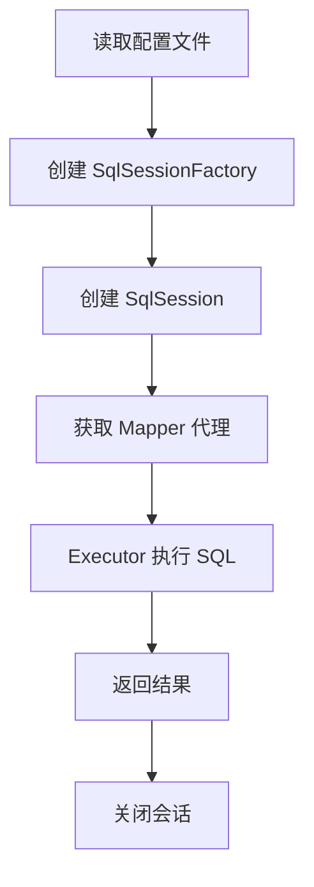

# 01MyBatis 入门基础

**学习目标：**
> * 理解什么是 MyBatis 以及它的作用
> * 掌握 MyBatis 与 JDBC、Hibernate 的区别
> * 能够搭建 MyBatis 开发环境
> * 完成第一个 MyBatis 程序（Hello World）
> * 理解 MyBatis 核心组件的作用

---

## 1. 什么是 MyBatis？

### 1.1 MyBatis 简介

MyBatis 是一款优秀的**持久层框架**，它支持自定义 SQL、存储过程以及高级映射。

* **官网**：https://mybatis.org/mybatis-3/
* **GitHub**：https://github.com/mybatis/mybatis-3
* **当前稳定版本**：MyBatis 3.5.x

MyBatis 免除了几乎所有的 JDBC 代码以及设置参数和获取结果集的工作。MyBatis 可以通过简单的 XML 或注解来配置和映射原始类型、接口和 Java POJO（Plain Old Java Objects，普通老式 Java 对象）为数据库中的记录。

### 1.2 持久层概念

在理解 MyBatis 之前，先要明确什么是"持久层"：

* **持久化**：将数据保存到可掉电式存储设备中（如数据库、磁盘文件等），以便之后可以重新访问
* **持久层**：专注于实现数据持久化的应用逻辑层，通常对应 DAO（Data Access Object）层

简单来说，持久层就是负责和数据库打交道的代码层。

---

## 2. 为什么要使用 MyBatis？

### 2.1 传统 JDBC 的问题

在没有使用 ORM 框架之前，我们使用原生 JDBC 操作数据库：

```java
// 传统 JDBC 查询示例
public User getUserById(Integer id) {
    Connection conn = null;
    PreparedStatement pstmt = null;
    ResultSet rs = null;
    User user = null;
    
    try {
        // 1. 加载驱动
        Class.forName("com.mysql.jdbc.Driver");
        
        // 2. 获取连接
        conn = DriverManager.getConnection(
            "jdbc:mysql://localhost:3306/test", "root", "123456");
        
        // 3. 编写 SQL
        String sql = "SELECT * FROM user WHERE id = ?";
        
        // 4. 创建 Statement
        pstmt = conn.prepareStatement(sql);
        pstmt.setInt(1, id);
        
        // 5. 执行查询
        rs = pstmt.executeQuery();
        
        // 6. 处理结果集
        if (rs.next()) {
            user = new User();
            user.setId(rs.getInt("id"));
            user.setUsername(rs.getString("username"));
            user.setEmail(rs.getString("email"));
            user.setAge(rs.getInt("age"));
        }
        
    } catch (Exception e) {
        e.printStackTrace();
    } finally {
        // 7. 释放资源
        try {
            if (rs != null) rs.close();
            if (pstmt != null) pstmt.close();
            if (conn != null) conn.close();
        } catch (SQLException e) {
            e.printStackTrace();
        }
    }
    
    return user;
}
```

**JDBC 存在的问题：**

1. **代码冗余**：每次操作都需要重复加载驱动、获取连接、释放资源
2. **硬编码**：SQL 语句、数据库连接信息硬编码在 Java 代码中
3. **手动映射**：需要手动将 ResultSet 中的数据映射到 Java 对象
4. **维护困难**：SQL 修改需要重新编译 Java 代码
5. **性能问题**：频繁创建和关闭数据库连接影响性能

### 2.2 MyBatis vs JDBC vs Hibernate 对比

| 特性 | JDBC | MyBatis | Hibernate |
|------|------|---------|-----------|
| **学习成本** | 低 | 中等 | 高 |
| **SQL 控制** | 完全控制 | 手动编写 SQL | 自动生成 SQL |
| **灵活性** | 高 | 高 | 中等 |
| **开发效率** | 低 | 高 | 很高 |
| **性能优化** | 需手动优化 | 容易优化 | 较难优化 |
| **可移植性** | 高 | 中等 | 高 |
| **缓存机制** | 无 | 一级+二级缓存 | 完善的缓存 |
| **适用场景** | 简单项目 | 大多数项目 | 复杂业务系统 |

**三者选择建议：**

* **JDBC**：适合学习理解底层原理，或者极其简单的场景
* **MyBatis**：适合需要灵活控制 SQL、对性能要求较高的项目（国内最流行）
* **Hibernate**：适合快速开发、业务逻辑复杂但不太关注 SQL 细节的项目

---

## 3. MyBatis 环境搭建

### 3.1 创建 Maven 项目

首先创建一个 Maven 项目，在 `pom.xml` 中添加 MyBatis 依赖：

```xml
<?xml version="1.0" encoding="UTF-8"?>
<project xmlns="http://maven.apache.org/POM/4.0.0"
         xmlns:xsi="http://www.w3.org/2001/XMLSchema-instance"
         xsi:schemaLocation="http://maven.apache.org/POM/4.0.0 
         http://maven.apache.org/xsd/maven-4.0.0.xsd">
    <modelVersion>4.0.0</modelVersion>

    <groupId>com.example</groupId>
    <artifactId>mybatis-demo</artifactId>
    <version>1.0-SNAPSHOT</version>

    <properties>
        <maven.compiler.source>8</maven.compiler.source>
        <maven.compiler.target>8</maven.compiler.target>
        <project.build.sourceEncoding>UTF-8</project.build.sourceEncoding>
    </properties>

    <dependencies>
        <!-- MyBatis 核心依赖 -->
        <dependency>
            <groupId>org.mybatis</groupId>
            <artifactId>mybatis</artifactId>
            <version>3.5.13</version>
        </dependency>

        <!-- MySQL 驱动 -->
        <dependency>
            <groupId>mysql</groupId>
            <artifactId>mysql-connector-java</artifactId>
            <version>8.0.33</version>
        </dependency>

        <!-- JUnit 单元测试 -->
        <dependency>
            <groupId>junit</groupId>
            <artifactId>junit</artifactId>
            <version>4.13.2</version>
            <scope>test</scope>
        </dependency>

        <!-- Lombok（可选，简化实体类） -->
        <dependency>
            <groupId>org.projectlombok</groupId>
            <artifactId>lombok</artifactId>
            <version>1.18.30</version>
            <scope>provided</scope>
        </dependency>
    </dependencies>
</project>
```

### 3.2 准备数据库表

在 MySQL 中创建测试数据库和表：

```sql
-- 创建数据库
CREATE DATABASE mybatis_demo CHARACTER SET utf8mb4 COLLATE utf8mb4_unicode_ci;

-- 使用数据库
USE mybatis_demo;

-- 创建用户表
CREATE TABLE `user` (
  `id` INT PRIMARY KEY AUTO_INCREMENT COMMENT '用户ID',
  `username` VARCHAR(50) NOT NULL COMMENT '用户名',
  `email` VARCHAR(100) COMMENT '邮箱',
  `age` INT COMMENT '年龄',
  `create_time` DATETIME DEFAULT CURRENT_TIMESTAMP COMMENT '创建时间'
) ENGINE=InnoDB DEFAULT CHARSET=utf8mb4 COMMENT='用户表';

-- 插入测试数据
INSERT INTO `user` (`username`, `email`, `age`) VALUES
('张三', 'zhangsan@example.com', 25),
('李四', 'lisi@example.com', 28),
('王五', 'wangwu@example.com', 22),
('赵六', 'zhaoliu@example.com', 30);
```

### 3.3 创建实体类

创建与数据库表对应的 Java 实体类：

```java
package com.example.entity;

import lombok.Data;
import java.util.Date;

/**
 * 用户实体类
 */
@Data
public class User {
    private Integer id;
    private String username;
    private String email;
    private Integer age;
    private Date createTime;
}
```

> **提示**：如果不使用 Lombok，需要手动生成 getter、setter、toString 等方法。

---

## 4. 第一个 MyBatis 程序

### 4.1 创建 MyBatis 核心配置文件

在 `src/main/resources` 目录下创建 `mybatis-config.xml`：

```xml
<?xml version="1.0" encoding="UTF-8" ?>
<!DOCTYPE configuration
        PUBLIC "-//mybatis.org//DTD Config 3.0//EN"
        "http://mybatis.org/dtd/mybatis-3-config.dtd">

<configuration>
    <!-- 环境配置 -->
    <environments default="development">
        <environment id="development">
            <!-- 事务管理器 -->
            <transactionManager type="JDBC"/>
            <!-- 数据源 -->
            <dataSource type="POOLED">
                <property name="driver" value="com.mysql.cj.jdbc.Driver"/>
                <property name="url" value="jdbc:mysql://localhost:3306/mybatis_demo?useSSL=false&amp;serverTimezone=Asia/Shanghai&amp;characterEncoding=utf8"/>
                <property name="username" value="root"/>
                <property name="password" value="123456"/>
            </dataSource>
        </environment>
    </environments>

    <!-- 映射器配置 -->
    <mappers>
        <mapper resource="mapper/UserMapper.xml"/>
    </mappers>
</configuration>
```

**配置说明：**

* `<environments>`：配置数据库环境，可以配置多个环境（开发、测试、生产）
* `<transactionManager>`：事务管理器类型
  - `JDBC`：使用 JDBC 的事务管理
  - `MANAGED`：让容器管理事务（如 Spring）
* `<dataSource>`：数据源类型
  - `POOLED`：使用数据库连接池
  - `UNPOOLED`：不使用连接池
  - `JNDI`：使用 JNDI 数据源

### 4.2 创建 Mapper 接口

创建 `UserMapper.java` 接口：

```java
package com.example.mapper;

import com.example.entity.User;
import java.util.List;

/**
 * 用户 Mapper 接口
 */
public interface UserMapper {
    
    /**
     * 查询所有用户
     * @return 用户列表
     */
    List<User> findAll();
    
    /**
     * 根据 ID 查询用户
     * @param id 用户ID
     * @return 用户对象
     */
    User findById(Integer id);
    
    /**
     * 添加用户
     * @param user 用户对象
     * @return 影响行数
     */
    int insert(User user);
    
    /**
     * 更新用户
     * @param user 用户对象
     * @return 影响行数
     */
    int update(User user);
    
    /**
     * 删除用户
     * @param id 用户ID
     * @return 影响行数
     */
    int delete(Integer id);
}
```

### 4.3 创建 Mapper XML 文件

在 `src/main/resources/mapper` 目录下创建 `UserMapper.xml`：

```xml
<?xml version="1.0" encoding="UTF-8" ?>
<!DOCTYPE mapper
        PUBLIC "-//mybatis.org//DTD Mapper 3.0//EN"
        "http://mybatis.org/dtd/mybatis-3-mapper.dtd">

<!-- namespace 必须与 Mapper 接口的全限定名一致 -->
<mapper namespace="com.example.mapper.UserMapper">
    
    <!-- 查询所有用户 -->
    <select id="findAll" resultType="com.example.entity.User">
        SELECT * FROM user
    </select>
    
    <!-- 根据 ID 查询用户 -->
    <select id="findById" parameterType="int" resultType="com.example.entity.User">
        SELECT * FROM user WHERE id = #{id}
    </select>
    
    <!-- 添加用户 -->
    <insert id="insert" parameterType="com.example.entity.User">
        INSERT INTO user (username, email, age) 
        VALUES (#{username}, #{email}, #{age})
    </insert>
    
    <!-- 更新用户 -->
    <update id="update" parameterType="com.example.entity.User">
        UPDATE user 
        SET username = #{username}, email = #{email}, age = #{age}
        WHERE id = #{id}
    </update>
    
    <!-- 删除用户 -->
    <delete id="delete" parameterType="int">
        DELETE FROM user WHERE id = #{id}
    </delete>
    
</mapper>
```

**XML 配置说明：**

* `namespace`：命名空间，必须与 Mapper 接口的全限定名一致
* `id`：方法名，必须与接口中的方法名一致
* `parameterType`：参数类型（可选）
* `resultType`：返回值类型（查询时必须指定）
* `#{}`：占位符，防止 SQL 注入

### 4.4 编写测试代码

创建测试类 `UserMapperTest.java`：

```java
package com.example.test;

import com.example.entity.User;
import com.example.mapper.UserMapper;
import org.apache.ibatis.io.Resources;
import org.apache.ibatis.session.SqlSession;
import org.apache.ibatis.session.SqlSessionFactory;
import org.apache.ibatis.session.SqlSessionFactoryBuilder;
import org.junit.After;
import org.junit.Before;
import org.junit.Test;

import java.io.IOException;
import java.io.InputStream;
import java.util.List;

/**
 * MyBatis 测试类
 */
public class UserMapperTest {
    
    private SqlSessionFactory sqlSessionFactory;
    
    /**
     * 初始化：创建 SqlSessionFactory
     */
    @Before
    public void init() throws IOException {
        // 1. 读取配置文件
        String resource = "mybatis-config.xml";
        InputStream inputStream = Resources.getResourceAsStream(resource);
        
        // 2. 创建 SqlSessionFactory
        sqlSessionFactory = new SqlSessionFactoryBuilder().build(inputStream);
    }
    
    /**
     * 测试查询所有用户
     */
    @Test
    public void testFindAll() {
        // 3. 创建 SqlSession
        SqlSession session = sqlSessionFactory.openSession();
        
        try {
            // 4. 获取 Mapper 代理对象
            UserMapper mapper = session.getMapper(UserMapper.class);
            
            // 5. 调用方法
            List<User> users = mapper.findAll();
            
            // 6. 处理结果
            for (User user : users) {
                System.out.println(user);
            }
        } finally {
            // 7. 关闭会话
            session.close();
        }
    }
    
    /**
     * 测试根据 ID 查询用户
     */
    @Test
    public void testFindById() {
        SqlSession session = sqlSessionFactory.openSession();
        
        try {
            UserMapper mapper = session.getMapper(UserMapper.class);
            User user = mapper.findById(1);
            System.out.println(user);
        } finally {
            session.close();
        }
    }
    
    /**
     * 测试添加用户
     */
    @Test
    public void testInsert() {
        SqlSession session = sqlSessionFactory.openSession();
        
        try {
            UserMapper mapper = session.getMapper(UserMapper.class);
            
            User user = new User();
            user.setUsername("测试用户");
            user.setEmail("test@example.com");
            user.setAge(20);
            
            int rows = mapper.insert(user);
            System.out.println("影响行数：" + rows);
            
            // 提交事务
            session.commit();
        } catch (Exception e) {
            // 回滚事务
            session.rollback();
            e.printStackTrace();
        } finally {
            session.close();
        }
    }
    
    /**
     * 测试更新用户
     */
    @Test
    public void testUpdate() {
        SqlSession session = sqlSessionFactory.openSession();
        
        try {
            UserMapper mapper = session.getMapper(UserMapper.class);
            
            User user = mapper.findById(1);
            user.setUsername("张三丰");
            user.setAge(26);
            
            int rows = mapper.update(user);
            System.out.println("影响行数：" + rows);
            
            session.commit();
        } catch (Exception e) {
            session.rollback();
            e.printStackTrace();
        } finally {
            session.close();
        }
    }
    
    /**
     * 测试删除用户
     */
    @Test
    public void testDelete() {
        SqlSession session = sqlSessionFactory.openSession();
        
        try {
            UserMapper mapper = session.getMapper(UserMapper.class);
            
            int rows = mapper.delete(5);
            System.out.println("影响行数：" + rows);
            
            session.commit();
        } catch (Exception e) {
            session.rollback();
            e.printStackTrace();
        } finally {
            session.close();
        }
    }
}
```

### 4.5 运行测试

运行 `testFindAll()` 方法，如果看到以下输出，说明配置成功：

```
User(id=1, username=张三, email=zhangsan@example.com, age=25, createTime=...)
User(id=2, username=李四, email=lisi@example.com, age=28, createTime=...)
User(id=3, username=王五, email=wangwu@example.com, age=22, createTime=...)
User(id=4, username=赵六, email=zhaoliu@example.com, age=30, createTime=...)
```

---

## 5. MyBatis 核心组件

### 5.1 核心组件架构图

```
SqlSessionFactoryBuilder
        ↓ (build)
SqlSessionFactory
        ↓ (openSession)
SqlSession
        ↓ (getMapper)
Mapper 接口
        ↓ (执行 SQL)
Executor
        ↓
MappedStatement
```

### 5.2 组件详解

#### 5.2.1 SqlSessionFactoryBuilder

* **作用**：构建 SqlSessionFactory
* **生命周期**：方法级别，用完即可丢弃
* **使用方式**：

```java
String resource = "mybatis-config.xml";
InputStream inputStream = Resources.getResourceAsStream(resource);
SqlSessionFactory factory = new SqlSessionFactoryBuilder().build(inputStream);
```

#### 5.2.2 SqlSessionFactory

* **作用**：创建 SqlSession 的工厂
* **生命周期**：应用级别，整个应用运行期间只创建一个实例
* **特点**：线程安全，可以使用单例模式管理
* **使用方式**：

```java
SqlSession session = factory.openSession();
```

#### 5.2.3 SqlSession

* **作用**：执行 SQL 命令的核心对象
* **生命周期**：请求级别，每次数据库操作创建一个新的 SqlSession
* **特点**：**非线程安全**，不能共享
* **使用方式**：

```java
// 方式一：获取 Mapper 代理（推荐）
UserMapper mapper = session.getMapper(UserMapper.class);
List<User> users = mapper.findAll();

// 方式二：直接执行 SQL（不推荐）
List<User> users = session.selectList("com.example.mapper.UserMapper.findAll");
```

#### 5.2.4 Mapper 接口

* **作用**：定义数据库操作的接口
* **特点**：不需要实现类，MyBatis 通过动态代理自动生成实现
* **要求**：
  - 接口方法名必须与 XML 中的 `id` 一致
  - 接口方法参数必须与 XML 中的 `parameterType` 匹配
  - 接口方法返回值必须与 XML 中的 `resultType` 匹配

#### 5.2.5 Executor

* **作用**：SQL 执行器，真正执行 SQL 的对象
* **类型**：
  - `SimpleExecutor`：默认执行器
  - `ReuseExecutor`：可重用预处理语句的执行器
  - `BatchExecutor`：批量执行器

#### 5.2.6 MappedStatement

* **作用**：封装了 SQL 语句的所有信息
* **内容**：SQL 语句、输入参数、输出结果类型等

---

## 6. MyBatis 工作流程



**工作流程步骤：**

1. **读取配置文件**：读取 `mybatis-config.xml` 和 Mapper XML 文件
2. **创建 SqlSessionFactory**：解析配置信息，构建工厂对象
3. **创建 SqlSession**：通过工厂创建会话对象
4. **获取 Mapper 代理**：通过动态代理生成 Mapper 接口的实现
5. **执行 SQL**：Executor 执行器执行 SQL 语句
6. **返回结果**：将结果映射为 Java 对象返回
7. **关闭会话**：释放数据库连接资源

---

## 7. 常见问题与解决方案

### 7.1 找不到 Mapper XML 文件

**错误信息**：
```
Could not find resource mapper/UserMapper.xml
```

**解决方案**：
确保 XML 文件放在 `src/main/resources` 目录下，并且路径正确。

### 7.2 namespace 不一致

**错误信息**：
```
Type interface com.example.mapper.UserMapper is not known to the MapperRegistry.
```

**解决方案**：
检查 XML 中的 `namespace` 是否与 Mapper 接口的全限定名完全一致。

### 7.3 数据库连接失败

**错误信息**：
```
Communications link failure
```

**解决方案**：
1. 检查 MySQL 服务是否启动
2. 检查数据库 URL、用户名、密码是否正确
3. 检查 MySQL 驱动版本是否与数据库版本匹配

### 7.4 SQL 语法错误

**错误信息**：
```
You have an error in your SQL syntax
```

**解决方案**：
1. 检查 XML 中的 SQL 语句是否正确
2. 注意特殊字符需要转义（如 `&` 写成 `&amp;`）
3. 使用 CDATA 包裹 SQL 语句：

```xml
<select id="findAll" resultType="com.example.entity.User">
    <![CDATA[
        SELECT * FROM user WHERE age > 18
    ]]>
</select>
```

---

## 8. 实战练习

### 练习 1：基础 CRUD 操作

1. 创建商品表 `product`，包含字段：id、name、price、stock、description
2. 创建对应的实体类和 Mapper
3. 实现商品的增删改查功能

### 练习 2：条件查询

1. 实现根据用户名模糊查询
2. 实现根据年龄范围查询
3. 实现多条件组合查询

### 练习 3：批量操作

1. 实现批量插入用户
2. 实现批量删除用户

---

## 9. 总结

### 9.1 核心知识点

✅ **MyBatis 是什么**：优秀的持久层框架，简化 JDBC 操作  
✅ **为什么用 MyBatis**：解决 JDBC 代码冗余、硬编码、手动映射等问题  
✅ **环境搭建**：Maven 依赖、数据库准备、配置文件  
✅ **核心组件**：SqlSessionFactory、SqlSession、Mapper 接口  
✅ **工作流程**：配置 → 工厂 → 会话 → 代理 → 执行 → 返回  

### 9.2 关键配置

* **mybatis-config.xml**：核心配置文件，配置数据源、事务管理器等
* **Mapper XML**：SQL 映射文件，定义 SQL 语句和映射关系
* **Mapper 接口**：定义数据库操作方法

### 9.3 注意事项

⚠️ SqlSession 是非线程安全的，不能共享  
⚠️ 记得在使用后关闭 SqlSession  
⚠️ 增删改操作需要手动提交事务（session.commit()）  
⚠️ namespace 和方法名必须与接口保持一致  

---

## 10. 下一步学习

恭喜完成了 MyBatis 入门！接下来你可以学习：

📖 [02.MyBatis 核心配置详解](../02.MyBatis核心配置详解.md)  
📖 [03.MyBatis Mapper XML 映射文件](../03.MyBatis-Mapper-XML映射文件.md)  
📖 [04.MyBatis 接口绑定与注解开发](../04.MyBatis接口绑定与注解开发.md)

---

**参考资料：**
* MyBatis 官方文档：https://mybatis.org/mybatis-3/zh/index.html
* MyBatis GitHub：https://github.com/mybatis/mybatis-3
