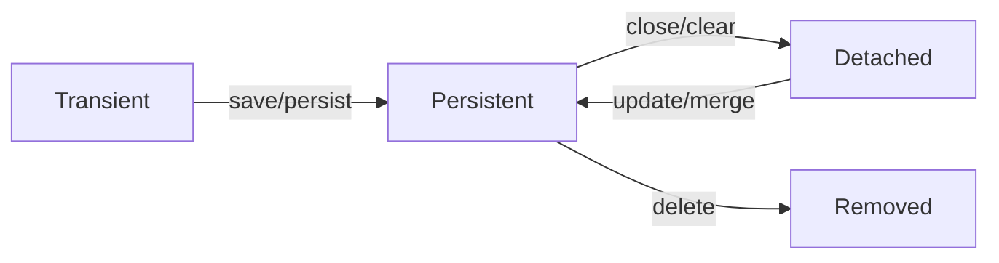

# 04Hibernate CRUD 操作

**学习目标：**
> * 掌握 Session 的基本 CRUD 操作
> * 理解 save() 和 persist() 的区别
> * 理解 get() 和 load() 的区别
> * 掌握 update()、merge()、saveOrUpdate() 的使用场景
> * 理解对象状态转换和脏检查机制

---

## 1. Session 简介

### 1.1 Session 的作用

Session 是 Hibernate 与数据库交互的核心接口，提供：
* CRUD 操作（增删改查）
* 事务管理
* 缓存管理（一级缓存）
* 查询执行

### 1.2 Session 的特点

* **非线程安全**：每个线程应该有独立的 Session
* **轻量级**：创建和销毁成本低
* **短生命周期**：通常在请求级别使用

### 1.3 获取 Session

```java
// 方式一：直接打开
Session session = sessionFactory.openSession();

// 方式二：从当前线程获取（需要配置）
Session session = sessionFactory.getCurrentSession();
```

**配置 getCurrentSession**：

```xml
<property name="hibernate.current_session_context_class">thread</property>
```

---

## 2. 保存操作（Create）

### 2.1 save() 方法

```java
@Test
public void testSave() {
    Session session = sessionFactory.openSession();
    Transaction tx = session.beginTransaction();
    
    User user = new User();
    user.setUsername("张三");
    user.setEmail("zhangsan@example.com");
    user.setAge(25);
    
    // 保存对象，返回生成的 ID
    Serializable id = session.save(user);
    System.out.println("生成的ID: " + id);
    
    tx.commit();
    session.close();
}
```

**特点**：
* 立即执行 INSERT 语句
* 返回生成的主键值
* 可以在事务外调用（但不推荐）

### 2.2 persist() 方法

```java
@Test
public void testPersist() {
    Session session = sessionFactory.openSession();
    Transaction tx = session.beginTransaction();
    
    User user = new User();
    user.setUsername("李四");
    user.setEmail("lisi@example.com");
    user.setAge(28);
    
    // persist 不返回值
    session.persist(user);
    
    tx.commit();
    session.close();
}
```

**特点**：
* 符合 JPA 规范
* 不保证立即执行 INSERT（可能延迟到 flush 时）
* 无返回值
* 必须在事务中调用

### 2.3 save() vs persist()

| 特性 | save() | persist() |
|------|--------|-----------|
| **规范** | Hibernate 特有 | JPA 标准 |
| **返回值** | 返回 Serializable ID | 无返回值 |
| **执行时机** | 立即执行 INSERT | 可能延迟执行 |
| **事务外调用** | 可以（但不推荐） | 不可以 |
| **推荐场景** | 需要立即获取 ID | 遵循 JPA 规范 |

### 2.4 批量保存

```java
@Test
public void testBatchSave() {
    Session session = sessionFactory.openSession();
    Transaction tx = session.beginTransaction();
    
    try {
        for (int i = 1; i <= 1000; i++) {
            User user = new User();
            user.setUsername("用户" + i);
            user.setEmail("user" + i + "@example.com");
            user.setAge(20 + i % 30);
            
            session.save(user);
            
            // 每 50 条刷新并清空缓存
            if (i % 50 == 0) {
                session.flush();
                session.clear();
            }
        }
        
        tx.commit();
    } catch (Exception e) {
        tx.rollback();
        e.printStackTrace();
    } finally {
        session.close();
    }
}
```

**注意**：批量操作时必须定期 flush 和 clear，避免内存溢出。

---

## 3. 查询操作（Read）

### 3.1 get() 方法

```java
@Test
public void testGet() {
    Session session = sessionFactory.openSession();
    
    // 立即加载，如果记录不存在返回 null
    User user = session.get(User.class, 1L);
    
    if (user != null) {
        System.out.println("用户名: " + user.getUsername());
    } else {
        System.out.println("用户不存在");
    }
    
    session.close();
}
```

**特点**：
* 立即执行 SQL 查询
* 记录不存在时返回 `null`
* 返回真实对象

### 3.2 load() 方法

```java
@Test
public void testLoad() {
    Session session = sessionFactory.openSession();
    Transaction tx = session.beginTransaction();
    
    try {
        // 延迟加载，返回代理对象
        User user = session.load(User.class, 1L);
        
        // 只有访问属性时才执行 SQL
        System.out.println("用户名: " + user.getUsername());
        
        tx.commit();
    } catch (ObjectNotFoundException e) {
        System.out.println("用户不存在");
        tx.rollback();
    } finally {
        session.close();
    }
}
```

**特点**：
* 延迟加载，返回代理对象
* 记录不存在时抛出 `ObjectNotFoundException`
* 只在访问属性时才执行 SQL

### 3.3 get() vs load()

| 特性 | get() | load() |
|------|-------|--------|
| **加载时机** | 立即加载 | 延迟加载 |
| **返回值** | 真实对象 | 代理对象 |
| **记录不存在** | 返回 null | 抛出异常 |
| **性能** | 始终执行 SQL | 可能不执行 SQL |
| **推荐场景** | 大多数情况 | 确定记录存在且只需引用 |

**使用建议**：
* **优先使用 get()**：更安全、更直观
* **使用 load() 的场景**：
  - 确定记录一定存在
  - 只需要对象的引用（如设置外键）
  - 不需要访问其他属性

```java
// load() 的典型用法：设置外键
Order order = new Order();
User user = session.load(User.class, 1L);  // 不执行 SQL
order.setUser(user);  // 只需要 ID
session.save(order);  // 执行 INSERT
```

### 3.4 查询多个对象

```java
@Test
public void testQueryMultiple() {
    Session session = sessionFactory.openSession();
    
    // HQL 查询
    List<User> users = session.createQuery("FROM User WHERE age > :age", User.class)
            .setParameter("age", 20)
            .list();
    
    users.forEach(user -> System.out.println(user.getUsername()));
    
    session.close();
}
```

---

## 4. 更新操作（Update）

### 4.1 自动脏检查（推荐）

```java
@Test
public void testDirtyChecking() {
    Session session = sessionFactory.openSession();
    Transaction tx = session.beginTransaction();
    
    // 查询对象（持久态）
    User user = session.get(User.class, 1L);
    System.out.println("修改前: " + user.getUsername());
    
    // 修改属性
    user.setUsername("新名字");
    user.setAge(26);
    
    // 提交事务时自动执行 UPDATE
    tx.commit();
    
    session.close();
}
```

**输出 SQL**：
```sql
SELECT u.id, u.username, u.email, u.age FROM user u WHERE u.id = ?
UPDATE user SET username = ?, age = ? WHERE id = ?
```

**原理**：
* Session 维护持久化对象的快照
* 事务提交时比较当前值与快照
* 如果有差异，自动生成 UPDATE 语句

### 4.2 update() 方法

```java
@Test
public void testUpdate() {
    Session session = sessionFactory.openSession();
    Transaction tx = session.beginTransaction();
    
    // 游离态对象
    User user = new User();
    user.setId(1L);
    user.setUsername("更新的名字");
    user.setEmail("newemail@example.com");
    user.setAge(30);
    
    // 将游离态对象重新关联到 Session
    session.update(user);
    
    tx.commit();
    session.close();
}
```

**使用场景**：
* 对象在 Session 外被修改
* 需要将游离态对象重新附加到 Session

**注意**：
* 如果 Session 中已有相同 ID 的对象，会抛出异常
* 所有字段都会被更新（包括 null 值）

### 4.3 merge() 方法

```java
@Test
public void testMerge() {
    Session session = sessionFactory.openSession();
    Transaction tx = session.beginTransaction();
    
    // 游离态对象
    User detachedUser = new User();
    detachedUser.setId(1L);
    detachedUser.setUsername("合并的名字");
    detachedUser.setAge(35);
    
    // merge 返回新的持久态对象
    User managedUser = session.merge(detachedUser);
    
    System.out.println("是否同一对象: " + (detachedUser == managedUser));  // false
    
    tx.commit();
    session.close();
}
```

**特点**：
* 复制游离态对象的状态到持久态对象
* 返回新的持久态对象
* 原对象仍然是游离态
* 如果 Session 中没有该对象，会先查询再更新

### 4.4 update() vs merge()

| 特性 | update() | merge() |
|------|----------|---------|
| **返回值** | void | 返回持久态对象 |
| **对象状态** | 将原对象变为持久态 | 创建新的持久态对象 |
| **Session 中已有对象** | 抛出异常 | 正常合并 |
| **安全性** | 较低 | 较高 |
| **推荐程度** | 较少使用 | 推荐使用 |

**使用建议**：
* **优先使用脏检查**：最简单、最常用
* **需要手动更新时用 merge()**：更安全
* **尽量避免 update()**：容易出错

### 4.5 选择性更新

只更新非 null 字段：

```java
@Test
public void testSelectiveUpdate() {
    Session session = sessionFactory.openSession();
    Transaction tx = session.beginTransaction();
    
    User user = session.get(User.class, 1L);
    
    // 只修改部分字段
    user.setUsername("新名字");
    // email 和 age 不变
    
    tx.commit();  // 只更新 username
    session.close();
}
```

或者使用 HQL：

```java
@Test
public void testHQLUpdate() {
    Session session = sessionFactory.openSession();
    Transaction tx = session.beginTransaction();
    
    int affectedRows = session.createQuery(
            "UPDATE User SET username = :name WHERE id = :id")
            .setParameter("name", "新名字")
            .setParameter("id", 1L)
            .executeUpdate();
    
    System.out.println("影响行数: " + affectedRows);
    
    tx.commit();
    session.close();
}
```

---

## 5. 删除操作（Delete）

### 5.1 delete() 方法

```java
@Test
public void testDelete() {
    Session session = sessionFactory.openSession();
    Transaction tx = session.beginTransaction();
    
    // 先查询
    User user = session.get(User.class, 1L);
    
    if (user != null) {
        // 删除对象
        session.delete(user);
        System.out.println("删除成功");
    }
    
    tx.commit();
    session.close();
}
```

### 5.2 删除游离态对象

```java
@Test
public void testDeleteDetached() {
    Session session = sessionFactory.openSession();
    Transaction tx = session.beginTransaction();
    
    User user = new User();
    user.setId(5L);
    
    // 需要先 merge 再 delete
    User managedUser = session.merge(user);
    session.delete(managedUser);
    
    tx.commit();
    session.close();
}
```

### 5.3 批量删除

```java
@Test
public void testBatchDelete() {
    Session session = sessionFactory.openSession();
    Transaction tx = session.beginTransaction();
    
    // HQL 批量删除
    int affectedRows = session.createQuery(
            "DELETE FROM User WHERE age < :age")
            .setParameter("age", 18)
            .executeUpdate();
    
    System.out.println("删除了 " + affectedRows + " 条记录");
    
    tx.commit();
    session.close();
}
```

### 5.4 级联删除

```java
@Entity
public class User {
    
    @OneToMany(mappedBy = "user", cascade = CascadeType.REMOVE)
    private List<Order> orders;
}
```

删除用户时，会自动删除其所有订单。

---

## 6. 对象状态转换

### 6.1 三种状态详解

<!-- TODO: 插入图片：Hibernate 对象状态转换图 -->

#### （1）瞬时态（Transient）

```java
User user = new User();
user.setUsername("张三");
// 状态：Transient
// 特点：没有 ID，未与 Session 关联，数据库中无记录
```

#### （2）持久态（Persistent/Managed）

```java
session.save(user);
// 状态：Persistent
// 特点：有 ID，与 Session 关联，数据库中有记录
//       属性变化会自动同步到数据库
```

#### （3）游离态（Detached）

```java
session.close();
// 状态：Detached
// 特点：有 ID，未与 Session 关联，数据库中有记录
//       属性变化不会同步到数据库
```

### 6.2 状态转换方法



**转换方法**：

| 转换 | 方法 |
|------|------|
| Transient → Persistent | `save()`, `persist()` |
| Persistent → Detached | `close()`, `clear()`, `evict()` |
| Detached → Persistent | `update()`, `merge()`, `lock()` |
| Persistent → Removed | `delete()` |

### 6.3 evict() - 从 Session 中移除

```java
@Test
public void testEvict() {
    Session session = sessionFactory.openSession();
    
    User user = session.get(User.class, 1L);  // Persistent
    System.out.println(user.getUsername());
    
    // 从 Session 中移除，变为 Detached
    session.evict(user);
    
    // 再次查询会执行 SQL
    User user2 = session.get(User.class, 1L);
    
    session.close();
}
```

### 6.4 clear() - 清空 Session

```java
@Test
public void testClear() {
    Session session = sessionFactory.openSession();
    Transaction tx = session.beginTransaction();
    
    List<User> users = session.createQuery("FROM User", User.class).list();
    
    // 清空 Session 缓存
    session.clear();
    
    // 所有对象都变为 Detached
    tx.commit();
    session.close();
}
```

---

## 7. 事务管理

### 7.1 基本事务操作

```java
@Test
public void testTransaction() {
    Session session = sessionFactory.openSession();
    Transaction tx = null;
    
    try {
        tx = session.beginTransaction();
        
        // 执行数据库操作
        User user = new User();
        user.setUsername("张三");
        session.save(user);
        
        // 提交事务
        tx.commit();
        
    } catch (Exception e) {
        // 回滚事务
        if (tx != null && tx.isActive()) {
            tx.rollback();
        }
        e.printStackTrace();
    } finally {
        session.close();
    }
}
```

### 7.2 事务隔离级别

```xml
<!-- 在 hibernate.cfg.xml 中配置 -->
<property name="hibernate.connection.isolation">2</property>
```

**隔离级别**：

| 值 | 隔离级别 | 说明 |
|----|---------|------|
| 1 | READ_UNCOMMITTED | 读未提交 |
| 2 | READ_COMMITTED | 读已提交 |
| 4 | REPEATABLE_READ | 可重复读 |
| 8 | SERIALIZABLE | 串行化 |

### 7.3 只读事务优化

```java
@Test
public void testReadOnlyTransaction() {
    Session session = sessionFactory.openSession();
    Transaction tx = session.beginTransaction();
    
    // 设置为只读，提高性能
    tx.setTimeout(30);
    
    List<User> users = session.createQuery("FROM User", User.class).list();
    
    tx.commit();
    session.close();
}
```

---

## 8. Flush 机制

### 8.1 什么是 Flush？

Flush 是将 Session 缓存中的变更同步到数据库的过程。

### 8.2 Flush 时机

* 事务提交时
* 执行查询前（必要时）
* 手动调用 `session.flush()`

### 8.3 手动 Flush

```java
@Test
public void testFlush() {
    Session session = sessionFactory.openSession();
    Transaction tx = session.beginTransaction();
    
    User user = new User();
    user.setUsername("张三");
    session.save(user);
    
    // 手动 flush，立即执行 INSERT
    session.flush();
    
    // 此时数据库中已有记录，但事务未提交
    
    tx.commit();
    session.close();
}
```

### 8.4 Flush 模式

```java
// 总是 flush（默认）
session.setFlushMode(FlushMode.ALWAYS);

// 只在提交时 flush
session.setFlushMode(FlushMode.COMMIT);

// 手动控制
session.setFlushMode(FlushMode.MANUAL);
```

---

## 9. 完整 CRUD 示例

```java
package com.example.test;

import com.example.entity.User;
import org.hibernate.Session;
import org.hibernate.SessionFactory;
import org.hibernate.Transaction;
import org.hibernate.cfg.Configuration;
import org.junit.*;

import java.util.List;

public class UserCRUDTest {
    
    private static SessionFactory sessionFactory;
    private Session session;
    
    @BeforeClass
    public static void initSessionFactory() {
        sessionFactory = new Configuration().configure().buildSessionFactory();
    }
    
    @Before
    public void openSession() {
        session = sessionFactory.openSession();
    }
    
    @After
    public void closeSession() {
        if (session != null && session.isOpen()) {
            session.close();
        }
    }
    
    @AfterClass
    public static void closeSessionFactory() {
        if (sessionFactory != null) {
            sessionFactory.close();
        }
    }
    
    /**
     * 创建
     */
    @Test
    public void testCreate() {
        Transaction tx = session.beginTransaction();
        
        User user = new User();
        user.setUsername("张三");
        user.setEmail("zhangsan@example.com");
        user.setAge(25);
        
        session.save(user);
        tx.commit();
        
        System.out.println("创建成功，ID: " + user.getId());
    }
    
    /**
     * 读取
     */
    @Test
    public void testRead() {
        User user = session.get(User.class, 1L);
        System.out.println("查询结果: " + user);
    }
    
    /**
     * 更新
     */
    @Test
    public void testUpdate() {
        Transaction tx = session.beginTransaction();
        
        User user = session.get(User.class, 1L);
        user.setUsername("李四");
        user.setAge(26);
        
        tx.commit();
        System.out.println("更新成功");
    }
    
    /**
     * 删除
     */
    @Test
    public void testDelete() {
        Transaction tx = session.beginTransaction();
        
        User user = session.get(User.class, 1L);
        if (user != null) {
            session.delete(user);
        }
        
        tx.commit();
        System.out.println("删除成功");
    }
    
    /**
     * 查询所有
     */
    @Test
    public void testFindAll() {
        List<User> users = session.createQuery("FROM User", User.class).list();
        users.forEach(System.out::println);
    }
}
```

---

## 10. 实战练习

### 练习 1：用户管理

1. 实现用户的完整 CRUD 操作
2. 测试 get() 和 load() 的区别
3. 观察脏检查机制

### 练习 2：批量操作

1. 批量插入 1000 条用户数据
2. 批量更新用户年龄
3. 批量删除指定条件的用户

### 练习 3：状态转换

1. 测试 Transient → Persistent → Detached 转换
2. 测试 merge() 和 update() 的区别
3. 测试 evict() 和 clear() 的效果

---

## 11. 总结

### 11.1 核心知识点

✅ **保存**：save()、persist()  
✅ **查询**：get()、load()  
✅ **更新**：脏检查、update()、merge()  
✅ **删除**：delete()、批量删除  
✅ **状态转换**：Transient、Persistent、Detached  
✅ **事务管理**：begin、commit、rollback  
✅ **Flush 机制**：自动 flush、手动 flush  

### 11.2 最佳实践

📌 优先使用脏检查进行更新  
📌 优先使用 get() 而非 load()  
📌 优先使用 merge() 而非 update()  
📌 批量操作时定期 flush 和 clear  
📌 及时关闭 Session  
📌 使用 try-catch-finally 管理事务  

---

## 12. 下一步学习

📖 [05.HQL 查询语言](../05.HQL查询语言.md)  
📖 [06.Criteria API 查询](../06.Criteria-API查询.md)  
📖 [07.Hibernate 关联映射](../07.Hibernate关联映射.md)

---

**参考资料：**
* Hibernate 官方文档 - Session：https://hibernate.org/orm/documentation/
* JPA 规范：https://jakarta.ee/specifications/persistence/
