# SpringBoot工作原理


## 1Spring技术生态

### 1.1概览

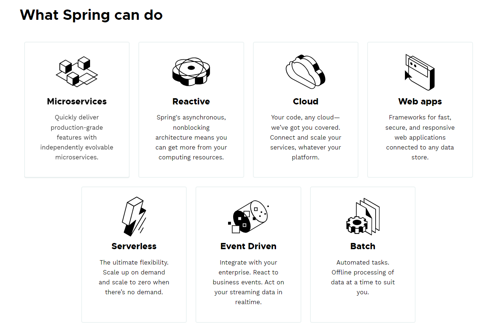 

- Spring框架的七大核心技术体系：微服务架构、响应式编程、云原生、Web应用、Serverless架构、事件驱动以及批处理。
- 这些技术体系各自独立但也有一定交集，在具备特定的技术特点之外，这些技术体系页各有其应用场景。


Spring家族技术体系都是在Spring Framework的基础上逐步演进而来的：

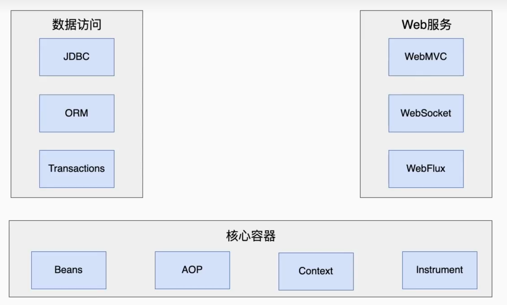 


### 1.2Spring Boot 与Web应用

Spring Boot构建再在Spring Framework的基础之上，是新一代的Web应用程序开发框架。我们可以通过下面这张图来了解Spring Boot的全貌：

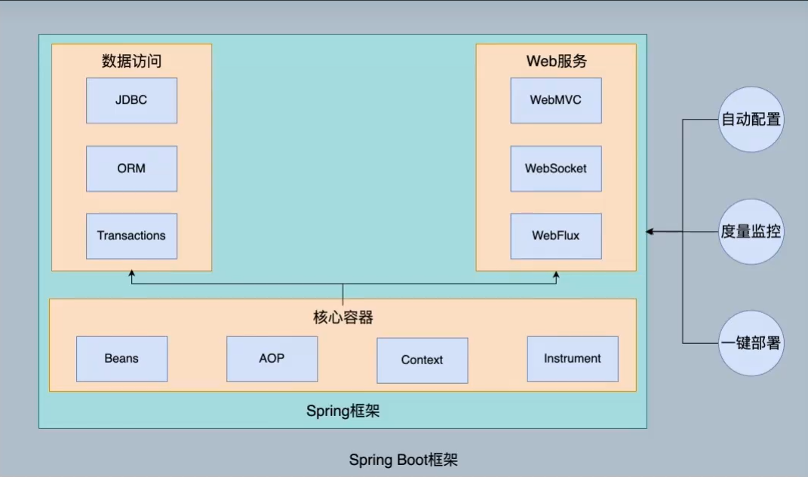 


通过Spring的官网（https://spring.io/projects/spring-boot#support），我们可以看到Spring Boot已经成为Spring中的顶级子项目。

自2014年4月发布1.0.0版本以来，Spring Boot俨然已经成为Java EE领域的开发Web应用程序的首选框架。

| Branch | Initial Release | End of Support | End Commercial Support * |
| :----- | :-------------- | :------------- | :----------------------- |
| 3.3.x  | 2024-05-23      | 2025-05-23     | 2026-08-23               |
| 3.2.x  | 2023-11-23      | 2024-11-23     | 2026-02-23               |
| 3.1.x  | 2023-05-18      | 2024-05-18     | 2025-08-18               |
| 3.0.x  | 2022-11-24      | 2023-11-24     | 2025-02-24               |
| 2.7.x  | 2022-05-19      | 2023-11-24     | 2025-08-24               |
| 2.6.x  | 2021-11-17      | 2022-11-24     | 2024-02-24               |
| 2.5.x  | 2021-05-20      | 2022-05-19     | 2023-08-24               |
| 2.4.x  | 2020-11-12      | 2021-11-18     | 2023-02-23               |
| 2.3.x  | 2020-05-15      | 2021-05-20     | 2022-08-20               |
| 2.2.x  | 2019-10-16      | 2020-10-16     | 2022-01-16               |
| 2.1.x  | 2018-10-30      | 2019-10-30     | 2021-01-30               |
| 2.0.x  | 2018-03-01      | 2019-03-01     | 2020-06-01               |
| 1.5.x  | 2017-01-30      | 2019-08-06     | 2020-11-06               |

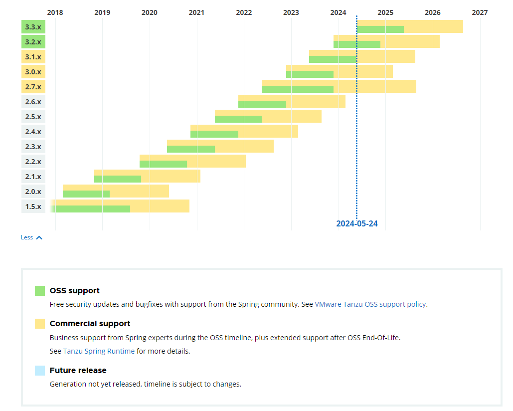 


### 1.3Spring Cloud 与微服务架构

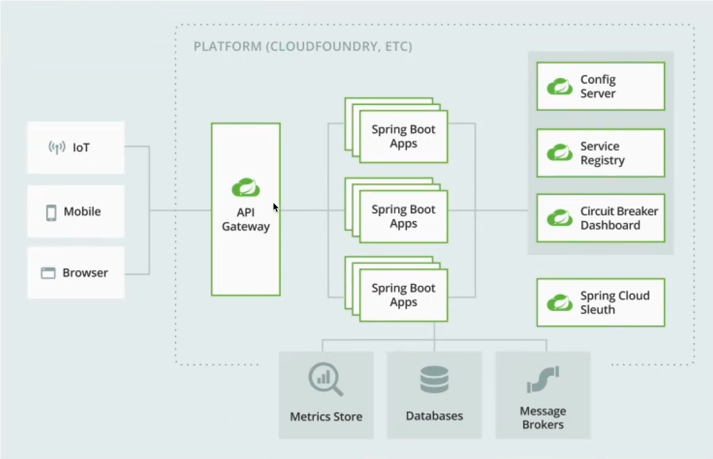

  


### 1.4 构建Spring Web应用程序

在典型的Web应用程序中，前后端通常采用HTTP协议来完成请求和响应，开发过程中需要完成URL地址的映射、HTTP请求的构建、数据的序列化和反序列化以及实现各个服务自身内部的业务逻辑。

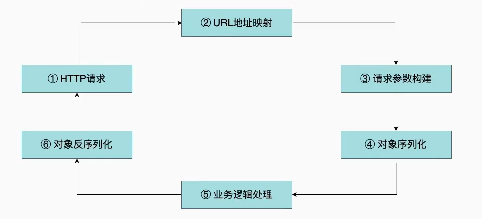 

基于Spring MVC的开发流程：

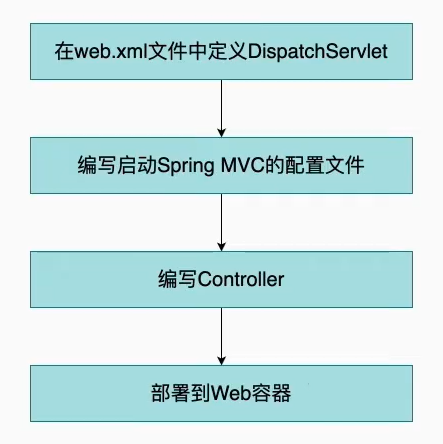  

基于传统的Spring MVC框架开发Web应用比较典型的问题就是配置工作过于复杂和繁重，以及缺少必要的应用程序管理和监控机制。

如果想要优化这一套开发过程，有几个点值得我们去改进，比如说减少不必要的配置工作、启动依赖项的自动管理、简化部署并提供应用监控等。

这些优化点就推动了以Spring Boot为代表的新一代开发框架的诞生，基于Spring Boot的开发流程如下：

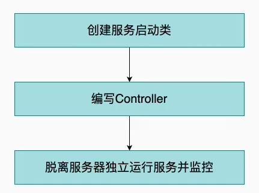  

Spring Boot与基于Spring MVC的开发流程在配置信息的管理、服务部署和监控等方面有明显不同。

作为Spring家族新的一员，Spring Boot提供了令人兴奋的特性，这些特性的核心价值在于确保了开发过程的简单性，具体体现在编码、配置、部署、监控等多个方面。

1. Spring Boot编码更简单。 我们只需在Maven中添加一项依赖并实现一个方法就可以提供微服务架构中所推崇的Restful风格接口。

2. Spring Boot使配置更简单。他把Spring中基于XML的功能配置方式转换为Java Config，同时提供了.yml文件来优化原有基于.properties和.xml文件的配置方案，yml文件对配置信息的组织更为直观方便，语义也更为强大。同时，基于Spring Boot的自动配置特性，对常见的各种工具和框架均提供了默认的starter组件来简化配置。

3. 在部署方案上，Spring Boot也创造了一键启动的新模式。Spring Boot部署包结构参考下图：

   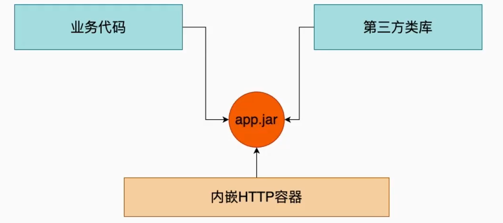 

   相较于传统模式下的war包，Spring Boot部署包既包含了业务代码和各种第三方类库，同时也内嵌了HTTP容器。

   这种包结构支持`java -jar application.jar`方式的一键启动，不需要部署独立的应用服务器，通过默认内嵌Tomcat就可以运行整个应用程序。

4. 最后，Spring Boot提供的Actuator组件，可以帮助开发和运维人员通过Restful接口获取应用程序当前的运行时状态并对这些状态背后的度量指标进行监控和报警。


### 1.5解剖一个Web应用

#### **项目结构：**

略

```java
com
 +- example
     +- myapplication
         +- MyApplication.java
         |
         +- customer
         |   +- Customer.java
         |   +- CustomerController.java
         |   +- CustomerService.java
         |   +- CustomerRepository.java
         |
         +- order
             +- Order.java
             +- OrderController.java
             +- OrderService.java
             +- OrderRepository.java
```


#### **启动类**

Bootstrap启动类结构简单且固化

```java
package com.dt.auth;


import org.springframework.boot.SpringApplication;
import org.springframework.boot.autoconfigure.SpringBootApplication;


@SpringBootApplication
public class TestApplication
{
    public static void main(String[] args)
    {
        SpringApplication.run(ChinasoftiAuthApplication.class, args);
    }
}
```


这里引入了一个全新的注解@SpringBootApplication。在Spring Boot中，添加了该注解的类就是整个应用程序的入口，

一方面会启动整个容器，

另一方面会自动扫描代码包结构下的@Component、@Service、@Controller、@Repository等注解，并把这些注解对应的类转化为Bean对象全部加载到Spring容器中。


#### **控制器类**

Bootstrap类为我们提供了Spring Boot应用程序的入口，相当于应用程序已经有了最基本的骨架。

接下来我们就可以添加HTTP请求的访问入口，表现在Spring Boot中就是一系列的Controller类。

这里的Controller与Spring MVC中的Controller在概念上是一致的。

一个典型的Controller如下：

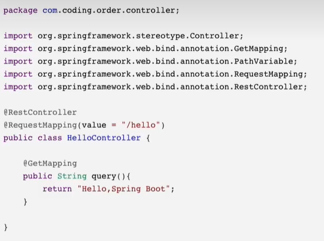 

以上代码中包含了@RestController，@RequestMapping和@GetMapping这三个注解。

- @RequestMapping：用于指定请求地址的映射关系
- @GetMapping：等同于指定了GET请求的@RequestMapping注解
- @RestController：是传统的Spring MVC的@Controller的升级版，相当于是@Controller和@ResponseEntity的结合体，会自动使用JSON实现序列化、反序列化操作


#### 配置文件

在src/main/resources目录下存在一个application.yml文件，这就是Spring Boot中的主配置文件。

例如，我们可以将如下所示的端口、服务名称以及数据库访问等配置信息添加到这个配置文中：

```yml
server:
	port: 8080
spring:
	application:
		name: testModule
	datasource:
		driver-class-name: com.muysql.cj.jdbc.Driver
		url: jdbc:mysql//127.0.0.1:3306/test_db
		username: root
		password: root
```

事实上，Spring Boot提供了强大的自动配置机制，如果没有特殊的配置需求，开发人员完全可以基于Spring Boot内置的配置体系完成诸如数据库访问相关配置信息的自动集成。


#### pom依赖


### 1.6设计理念和目标

随着项目的发展，Spring慢慢地集成了更多的开源软件，引入大量配置文件，这会导致程序储存率高、运行效率地下的问题。

为了解决这些问题，Spring Boot 应运而生。

Spring Boot本身并不提供Spring的核心功能，而是作为Spring的脚手架框架，以达到快速构建项目、预置三方配置、开箱即用的目的。

**设计理念：**

**约定由于配置（Convertion Over Configuration）**，又称按约定编程，是一种软件设计范式，旨在减少开发人员需要做决定的数量，执行起来简单而又不失灵活。

Spring Boot的核心设计完美遵从了此范式。 

Spring Boot的功能从细节到整体都是基于“约定优于配置”开发的，从基础框架的搭建、配置文件、中间件的集成、内置容器以及其生态中各种Starters，都遵从这个设计范式。

Starter作为Spring Boot的核心功能之一，基于自动配置代码提供了自动配置模块及依赖，让软件集成变得简单。

**设计目标：**

Spring Boot的研发团队——Pivotal公司。

Pivotal公司的企业目标是”致力于改变世界构造软件的方式 (We are transforming how the world builds software)"。Pivotal公司向企业客户提供云原生应用开发Paas平台及服务，采用敏捷软件开发方法论帮助企业客户开发软件，从而提高软件开发人员工作效率、减少软件运维成本，实现企业数字化转型、仃创新，帮助企业客户最终实现业务创新。Spring Boot框架的设计理念完美遵从了它所属企业的目标。Spring Boot不是为已解决的问题提供新的解决方案，而是为平台和开发者带来一种全新的体验:整合成熟技术框架、屏蔽系统复杂性、简化已有技术的使用，从而降低软件的使用门槛，提升软件开发和运维的效率。


## 2.Spring Boot体系结构

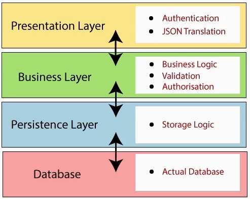 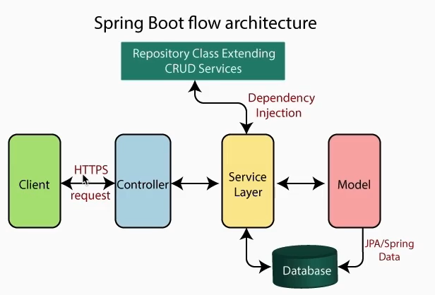  

- Presentation Layer ：表示层。处理HTTP请求，将JSON参数转换为对象，并对请求进行身份验证并将其传输到业务层。简而言之，其包括视图，即前端部分
- Business Layer：业务层。处理所有业务逻辑。它由服务类组成，并使用数据访问层提供的服务。它还执行授权和验证。
- Persistence Layer：持久层。包含所有的存储逻辑，并将业务对象和数据库进行相互转换。
- Database：数据库层。执行CRUD操作。


## 3.依赖原理剖析

### 3.1依赖管理概述

Spring Boot自动管理依赖关系和配置，每个Spring Boot版本都提供了它所支持的依赖项列表。

依赖关系列表是可与Maven一起使用的**物料清单(spring-boot-dependencies)**的一部分，因此我们无需在配置中指定依赖项的版本。

Spring Boot 自行管理，当更新Spring Boot版本时，Spring Boot将以一致的方式自动升级所有依赖项。

依赖管理的优点：

- 只需在一处指定Spring Boot的版本，它提供了依赖性信息的集中化
- 当从一个版本切换到另一个版本是时，只需切换Spring Boot的版本
- 避免了不同版本的Spring Boot库的不匹配

> 注意：如果需要，Spring Boot还允许覆盖依赖项的版本

Spring Boot其实是通过starter的形式，对spring-framwork进行装箱，消除了（但是兼容和保留）原来的XML配置，目的是更加便捷地集成其他框架，打造一个完成高效的开发生态。


### 3.2依赖管理系统

如果使用Spring Initializr创建一个Spring Boot项目的话，会发现pom文件中会加入了一个parent元素，这种做法其实本质上是把当前项目作为spring-boot-starter-parent的子项目。

```xml
<parent>
    <groupId>org.springframework.boot</groupId>
    <artifactId>spring-boot-starter-parent</artifactId>
    <!--   在这里指定了 spring boot 的版本     -->
    <version>2.7.2</version>
    <relativePath/> <!-- lookup parent from repository -->
</parent>

<dependencies>
    <dependency>
        <groupId>org.springframework.boot</groupId>
        <artifactId>spring-boot-starter-web</artifactId>
    </dependency>
    <dependency>
        <groupId>org.springframework.boot</groupId>
        <artifactId>spring-boot-starter-test</artifactId>
        <scope>test</scope>
    </dependency>
  			...
</dependencies>
```

Maven项目从spring-boot-starter-parent继承了以下功能：

- 默认的Java编译器版本
- UTF-8源编码
- 依赖关系，继承自spring-boot-dependencies POM
- 资源过滤
- 插件配置

父项目spring-boot-dependencies中几乎声明了所有开发中常用依赖的版本：

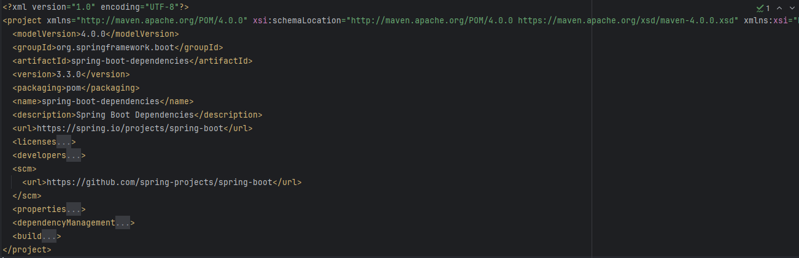 

spring-boot-dependencies的dependencyManagement节点，dependencies定义了Spring Boot版本的依赖的组件及其相应版本。

spring-boot-starter-parent通过继承spring-boot-dependencies实现了Spring Boot的版本依赖管理，所以Spring Boot工程继承spring-boot-starter-parent后已经具备版本锁定等配置了，这也就是Spring Boot项目中不需要些版本号的原因。

然后需要用到其他starter的时候，只需要在dependencies中直接引入即可，不再需要指定版本号，版本号由dependencyManagement中定义的版本号统一管理。

```xml
    <dependencies>
        <dependency>
            <groupId>org.springframework.boot</groupId>
            <artifactId>spring-boot-starter</artifactId>
        </dependency>

        <dependency>
            <groupId>org.springframework.boot</groupId>
            <artifactId>spring-boot-starter-test</artifactId>
            <scope>test</scope>
        </dependency>
    </dependencies>
```


### 3.3依赖覆盖

有些特殊的情况，可能项目中大部分的starter使用的是相对低的版本，但是由于部分功能需要使用到更高版本的个别starter，

就需要强制引入这个starter的更高版本，使用<java.version>标记来更改Java版本

```xml
<properties>
	<java.version>11</java.version>
</properties>
```

也可以直接指定引入依赖的版本覆盖掉全局的Spring Boot组件版本，这里应用了Maven的依赖调解原则：

```xml
<dependency>
	<groupId>org.springframwork.boot</groupId>
	<artifactId>spring-boot-starter-data-elasticsearch</artifactId>
	<version>2.3.1</version>
</dependency>
```


### 3.4相关依赖

在Spring Boot项目中只是引入了spring-boot-starter-web，并没有引入相关依赖，为何服务可以正常运行？

spring-boot-starter-web依赖启动器的主要作用是为了打包Web开发场景所需的底层所有依赖。


Spring Boot除了提供有上述介绍的Web依赖启动器外，还提供了其他许多开发场景的相关依赖。

| Name                                              | Description                                                  |
| :------------------------------------------------ | :----------------------------------------------------------- |
| `spring-boot-starter`                             | Core starter, including auto-configuration support, logging and YAML |
| `spring-boot-starter-activemq`                    | Starter for JMS messaging using Apache ActiveMQ              |
| `spring-boot-starter-amqp`                        | Starter for using Spring AMQP and Rabbit MQ                  |
| `spring-boot-starter-aop`                         | Starter for aspect-oriented programming with Spring AOP and AspectJ |
| `spring-boot-starter-artemis`                     | Starter for JMS messaging using Apache Artemis               |
| `spring-boot-starter-batch`                       | Starter for using Spring Batch                               |
| `spring-boot-starter-cache`                       | Starter for using Spring Framework’s caching support         |
| `spring-boot-starter-data-cassandra`              | Starter for using Cassandra distributed database and Spring Data Cassandra |
| `spring-boot-starter-data-cassandra-reactive`     | Starter for using Cassandra distributed database and Spring Data Cassandra Reactive |
| `spring-boot-starter-data-couchbase`              | Starter for using Couchbase document-oriented database and Spring Data Couchbase |
| `spring-boot-starter-data-couchbase-reactive`     | Starter for using Couchbase document-oriented database and Spring Data Couchbase Reactive |
| `spring-boot-starter-data-elasticsearch`          | Starter for using Elasticsearch search and analytics engine and Spring Data Elasticsearch |
| `spring-boot-starter-data-jdbc`                   | Starter for using Spring Data JDBC                           |
| `spring-boot-starter-data-jpa`                    | Starter for using Spring Data JPA with Hibernate             |
| `spring-boot-starter-data-ldap`                   | Starter for using Spring Data LDAP                           |
| `spring-boot-starter-data-mongodb`                | Starter for using MongoDB document-oriented database and Spring Data MongoDB |
| `spring-boot-starter-data-mongodb-reactive`       | Starter for using MongoDB document-oriented database and Spring Data MongoDB Reactive |
| `spring-boot-starter-data-neo4j`                  | Starter for using Neo4j graph database and Spring Data Neo4j |
| `spring-boot-starter-data-r2dbc`                  | Starter for using Spring Data R2DBC                          |
| `spring-boot-starter-data-redis`                  | Starter for using Redis key-value data store with Spring Data Redis and the Lettuce client |
| `spring-boot-starter-data-redis-reactive`         | Starter for using Redis key-value data store with Spring Data Redis reactive and the Lettuce client |
| `spring-boot-starter-data-rest`                   | Starter for exposing Spring Data repositories over REST using Spring Data REST and Spring MVC |
| `spring-boot-starter-freemarker`                  | Starter for building MVC web applications using FreeMarker views |
| `spring-boot-starter-graphql`                     | Starter for building GraphQL applications with Spring GraphQL |
| `spring-boot-starter-groovy-templates`            | Starter for building MVC web applications using Groovy Templates views |
| `spring-boot-starter-hateoas`                     | Starter for building hypermedia-based RESTful web application with Spring MVC and Spring HATEOAS |
| `spring-boot-starter-integration`                 | Starter for using Spring Integration                         |
| `spring-boot-starter-jdbc`                        | Starter for using JDBC with the HikariCP connection pool     |
| `spring-boot-starter-jersey`                      | Starter for building RESTful web applications using JAX-RS and Jersey. An alternative to [`spring-boot-starter-web`](https://docs.spring.io/spring-boot/reference/using/build-systems.html#spring-boot-starter-web) |
| `spring-boot-starter-jooq`                        | Starter for using jOOQ to access SQL databases with JDBC. An alternative to [`spring-boot-starter-data-jpa`](https://docs.spring.io/spring-boot/reference/using/build-systems.html#spring-boot-starter-data-jpa) or [`spring-boot-starter-jdbc`](https://docs.spring.io/spring-boot/reference/using/build-systems.html#spring-boot-starter-jdbc) |
| `spring-boot-starter-json`                        | Starter for reading and writing json                         |
| `spring-boot-starter-mail`                        | Starter for using Java Mail and Spring Framework’s email sending support |
| `spring-boot-starter-mustache`                    | Starter for building web applications using Mustache views   |
| `spring-boot-starter-oauth2-authorization-server` | Starter for using Spring Authorization Server features       |
| `spring-boot-starter-oauth2-client`               | Starter for using Spring Security’s OAuth2/OpenID Connect client features |
| `spring-boot-starter-oauth2-resource-server`      | Starter for using Spring Security’s OAuth2 resource server features |
| `spring-boot-starter-pulsar`                      | Starter for using Spring for Apache Pulsar                   |
| `spring-boot-starter-pulsar-reactive`             | Starter for using Spring for Apache Pulsar Reactive          |
| `spring-boot-starter-quartz`                      | Starter for using the Quartz scheduler                       |
| `spring-boot-starter-rsocket`                     | Starter for building RSocket clients and servers             |
| `spring-boot-starter-security`                    | Starter for using Spring Security                            |
| `spring-boot-starter-test`                        | Starter for testing Spring Boot applications with libraries including JUnit Jupiter, Hamcrest and Mockito |
| `spring-boot-starter-thymeleaf`                   | Starter for building MVC web applications using Thymeleaf views |
| `spring-boot-starter-validation`                  | Starter for using Java Bean Validation with Hibernate Validator |
| `spring-boot-starter-web`                         | Starter for building web, including RESTful, applications using Spring MVC. Uses Tomcat as the default embedded container |
| `spring-boot-starter-web-services`                | Starter for using Spring Web Services                        |
| `spring-boot-starter-webflux`                     | Starter for building WebFlux applications using Spring Framework’s Reactive Web support |
| `spring-boot-starter-websocket`                   | Starter for building WebSocket applications using Spring Framework’s MVC WebSocket support |


## 4.自动配置原理剖析

自动配置：根据我们添加的依赖，会自动将一些配置类的bean注册进ioc容器，可以使用@Autowired或者@Resource等注解来使用它。

### 4.1SpringBootApplication

Spring Boot 项目创建完会默认生成一个Application的入口类

```java
package org.example.myspringbootdemo;

import org.springframework.boot.SpringApplication;
import org.springframework.boot.autoconfigure.SpringBootApplication;

// 启动类
@SpringBootApplication
public class MySpringBootDemoApplication {

    public static void main(String[] args) {
        SpringApplication.run(MySpringBootDemoApplication.class, args);
    }

}
```

@SpringBootApplication是一个“三体”结构，实际上它是一个符合Annotation：

```java
package org.springframework.boot.autoconfigure;

@Target({ElementType.TYPE})  // 注解的适用范围， Type表示注解可以描述在类、接口、注解或枚举中
@Retention(RetentionPolicy.RUNTIME)  // 表示注解的生命周期，Runtime运行时
@Documented	// 表示注解可以记录在javadoc中
@Inherited	// 表示可以被子类继承该注解
@SpringBootConfiguration	// 表明该类为配置类
@EnableAutoConfiguration	// 启动自动配置功能
@ComponentScan(
    excludeFilters = {@Filter(
    type = FilterType.CUSTOM,
    classes = {TypeExcludeFilter.class}
), @Filter(
    type = FilterType.CUSTOM,
    classes = {AutoConfigurationExcludeFilter.class}
)}
)
public @interface SpringBootApplication {
    // 根据class来排除特定的自动配置类，使其不能加入Spring 容器，传入参数value类型是class类型
    @AliasFor(
        annotation = EnableAutoConfiguration.class
    )
    Class<?>[] exclude() default {};

    // 根据classname来排除特定的类，使其不能加入Spring容器，传入参数value类型是class的全类名字字符串数组
    @AliasFor(
        annotation = EnableAutoConfiguration.class
    )
    String[] excludeName() default {};

    // 扫描指定包，参数是包名的字符串数组，用于激活@Component等注解类的初始化
    @AliasFor(
        annotation = ComponentScan.class,
        attribute = "basePackages"
    )
    String[] scanBasePackages() default {};

    // 扫描特定的包，参数是Class类型数组
    @AliasFor(
        annotation = ComponentScan.class,
        attribute = "basePackageClasses"
    )
    Class<?>[] scanBasePackageClasses() default {};

    // bean名称生成器，用于命名被扫描并注册成Spring容器中的bean的bean名称
    @AliasFor(
        annotation = ComponentScan.class,
        attribute = "nameGenerator"
    )
    Class<? extends BeanNameGenerator> nameGenerator() default BeanNameGenerator.class;

    // 注解的意思是proxyBeanMethod配置类是用来指定@Bean注解标注的方法是否使用代理，默认是true使用代理
    // （proxyBeanMethod = true）[保证每个@Bean方法被调用多少次返回的组件都是单实例的]
    // （proxyBeanMethod = false）[每个@Bean方法被调用多少次返回的组件都是新创建的]
    
    @AliasFor(
        annotation = Configuration.class
    )
    boolean proxyBeanMethods() default true;
}

```

首先引出两个概念：Full全模式，Lite轻量级模式

- Full(ProxyBeanMethods = true) ： proxyBeanMethods参数设置为true时，即为Full全模式。

  该模式下，注入容器中的同一个组件无论被取出多少次都是同一个bean实例，即单例对象，在该模式下，Spring Boot每次启动都会判断检查容器中是否存在该组件。

- Lite(proxyBeanMethods = false)：proxyBeanMethods参数设置为false时，即为Lite轻量级模式。

  该模式下注入容器中的同一个组件无论被取出多少次都是不同的bean实例，即多实例对象，该模式下Spring Boot容器每次启动的时候会跳过检查容器中是否存在该组件


什么时候用Full全模式，什么时候用Lite轻量级模式？

- 当在你的同一个Configuration配置类中，注入到容器的bean实例之间有依赖关系时，建议使用Full模式
- 当在你的同一个Configuration配置类中，注入到容器的bean实例之间没有依赖关系时，建议使用Lite轻量级模式，以提高Spring Boot 的启动速度和性能


@AliasFor注解，注解用于桥接到其他注解，该注解的属性中制定了所桥接的注解类，@SpringBootApplication定义的属性再“三体”组合注解中已经定义过了，之所以使用@AliasFor注解并重新在@SpringBootApplication进行定义，更多的为了减少用户使用多注解带来的麻烦。


虽然@SpringBootApplication的定义使用了多个Annotation进行元信息标注，但实际上对于Spring Boot应用来说，重要的只有三个Annotation，而“三体”结构实际上指的就是这三个Annotation：

- SpringBootConfiguration
- EnableAutoConfiguration
- ComponentScan

所以，如果我们使用如下的SpringBoot启动类，整个Spring Boot应用依然可以与之前的启动类功能对等：


### 4.2SpringBootConfiguration

@SpringBootConfiguration：Spring Boot的配置类，标注在某个类上，表示这是一个Spring Boot的配置类。

查看@SpringBootConfiguration注解源码，核心代码具体如下：

```java
@Target(ElementType.TYPE)
@Retention(RetentionPolicy.RUNTIME)
@Documented
@Configuration
@Indexed
public @interface SpringBootConfiguration {
    @AliasFor(annotation = Configuration.class)
    boolean proxyBeanMethods() default true;
}
```

从上述源码可以看出，@SpringBootConfiguration注解内部有一个核心注解@Configuration，该注解是Spring框架提供的，表示当前类是一个配置类（XML配置文件的注解表现形式），并可以被组件扫描器扫描。

> 这里的@Configuration对我们来说并不陌生，他就是JavaConfig形式的Spring IOC容器的配置类使用的那个@Configuration，既然SpringBoot应用骨子里就是一个Spring应用，那么，自然需要加载某个IOC容器的配置，而SpringBoot社区推荐使用基于JavaConfig的配置形式，所以，很明显这里的启动类标注了@Configuration之后，本身其实也是一个IOC容器的配置类！

由此可见，@SpringBootConfiguration注解的作用与@Configuration注解相同，都是标识一个可以被组件扫描器扫描的配置类，只不过@SpringBootConfiguration是被Spring Boot进行了重新封装命名而已。

很多SpringBootConfiguration的代码示例都喜欢在启动类上直接标注@Configuration或者@SpringBootApplication，对于初接触SpringBoot的开发者来说，其实这种做法不便于理解，如果我们将上面的SpringBootApplication启动类拆分为两个独立的Java类，整个形势就明朗了：

```java
@Configuration
@EnableAutoConfiguration
@ComponentScan
public class HelloConfiguration {
    @Bean
    public HelloController controller() {
        return new HelloController();
    }
}

public class DemoApplication {
    public static void main(String[] args) {
        SpringApplication.run(HelloConfiguration.class, args);
    }
}
```

所以，启动类DemoApplication其实就是一个标准的standalone类型的Java程序的main函数启动类，没有什么特殊的。

而@Configuration标注的DemoConfiguration定义其实也是个普通的JavaConfig形势的IOC容器配置类，没啥新东西，全是Spring框架里的概念。


