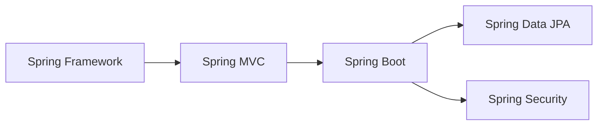

# Spring 技术栈学习路线

## 📚 模块概览

本模块系统讲解Spring家族核心技术栈,从基础到实战,帮助你全面掌握企业级Java开发技能。

> **注意**: 由于VuePress限制,此处不使用Mermaid图,仅作为学习路径参考。

---

## 🎯 学习路径

### 第一阶段: Spring Framework核心 (必修)

**前置知识**: Java基础、面向对象编程、Maven

#### 01-快速入门
- [01.Spring概述与生态](./01-Spring-Framework核心/01-快速入门/01.Spring概述与生态.md) - Spring简介、体系结构、IOC/DI概念
- [02.IOC容器核心概念](./01-Spring-Framework核心/01-快速入门/02.IOC容器核心概念.md) - IOC/DI案例、Bean配置、实例化方式
- [03.DI依赖注入实战](./01-Spring-Framework核心/01-快速入门/03.DI依赖注入实战.md) - 注入方式、自动装配、集合注入

#### 02-Bean管理
- 待补充: Bean生命周期详解
- 待补充: Bean作用域深入理解
- 待补充: FactoryBean高级用法

#### 03-AOP与事务
- 待补充: AOP核心概念
- 待补充: AspectJ注解开发
- 待补充: 声明式事务管理

#### 04-Spring-MVC-WEB开发
- [01.MVC架构原理](./01-Spring-Framework核心/04-Spring-MVC-WEB开发/01.MVC架构原理.md) - DispatcherServlet、请求映射、参数绑定
- [02.RESTful-API设计](./01-Spring-Framework核心/04-Spring-MVC-WEB开发/02.RESTful-API设计.md) - REST规范、统一响应、异常处理
- 待补充: 拦截器与过滤器实战

---

### 第二阶段: Spring Boot快速开发 (必修)

**前置知识**: Spring Framework核心、Servlet基础

#### 00-教程汇总
- [Spring Boot教程](./02-Spring-Boot快速开发/00-教程汇总/Spring%20Boot教程.md) - 完整教程索引

#### 01-核心原理
- [01.SpringBoot工作原理](./02-Spring-Boot快速开发/01-核心原理/01.SpringBoot工作原理.md) - 自动配置、Starter机制、启动流程

**待补充内容**:
- 02-Starter机制剖析
- 03-条件装配@Conditional
- 04-YAML配置语法
- 05-多环境配置Profile
- 06-整合MyBatis/MyBatis-Plus
- 07-Actuator监控端点

---

### 第三阶段: Spring Data JPA (选修)

**前置知识**: Spring Boot、数据库基础

#### 01-JPA入门
- [Spring-Data-Jpa入门](./03-Spring-Data-JPA/01-JPA入门/Spring-Data-Jpa入门.md) - JPA概念、基础CRUD

#### 02-主键生成策略
- [Jpa主键生成策略介绍](./03-Spring-Data-JPA/02-主键生成策略/Jpa主键生成策略介绍.md) - 各种主键生成方式对比

---

### 第四阶段: Spring Security安全框架 (必修)

**前置知识**: Spring Boot、JWT概念

#### 01-认证与授权基础
- [01.Security核心概念](./04-Spring-Security安全框架/01.认证与授权基础/01.Security核心概念.md) - 核心概念、内存认证、UserDetailsService、角色权限控制

#### 02-JWT令牌认证
- [01.JWT认证实战](./04-Spring-Security安全框架/02.JWT令牌认证/01.JWT认证实战.md) - JWT原理、整合Spring Security、Token刷新、黑名单机制

#### 03-RBAC权限模型
- [01.RBAC实战](./04-Spring-Security安全框架/03.RBAC权限模型/01.RBAC实战.md) - RBAC模型、数据库设计、动态权限配置

---

## 🗺️ 知识地图

### Spring Framework核心能力
- ✅ IOC/DI依赖注入
- ✅ AOP面向切面编程
- ✅ 声明式事务管理
- ⏳ 事件驱动模型
- ⏳ 国际化支持

### Spring MVC Web开发
- ✅ RESTful API设计
- ✅ 统一响应封装
- ✅ 全局异常处理
- ⏳ 拦截器实战
- ⏳ 文件上传下载

### Spring Boot生态
- ✅ 自动配置原理
- ⏳ Starter自定义
- ⏳ 整合常用中间件
- ⏳ 生产级最佳实践

---

## 📖 学习建议

### 初学者路线
1. **先学理论**: 理解IOC和DI的核心思想
2. **动手实践**: 跟着案例敲代码,不要只看
3. **循序渐进**: 先掌握Framework,再学Boot
4. **项目驱动**: 学完基础后做完整项目

### 进阶提升
1. **源码阅读**: 深入理解Spring设计模式
2. **性能优化**: 学习Bean生命周期调优
3. **扩展开发**: 自定义Starter和注解
4. **微服务**: 过渡到Spring Cloud

---

## 🔗 相关资源

### 官方文档
- [Spring Framework](https://spring.io/projects/spring-framework)
- [Spring Boot](https://spring.io/projects/spring-boot)
- [Spring Data](https://spring.io/projects/spring-data)

### 推荐书籍
- 《Spring实战(第5版)》
- 《Spring Boot实战》
- 《精通Spring Boot 42讲》

### 在线教程
- Spring官方指南: https://spring.io/guides
- Baeldung Spring教程: https://www.baeldung.com/spring

---

## 📝 更新日志

- **2026-06-02**: 重构目录结构,补全SpringBoot工作原理,新增Spring MVC模块
- **待更新**: 补充AOP与事务、Spring Security等模块

---

## 💡 贡献指南

欢迎提交Issue或PR完善本知识库!

**可以贡献的内容**:
- 补充缺失的章节
- 修正错误或不准确的内容
- 添加更多实战案例
- 优化文档结构和表达
